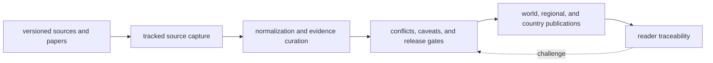
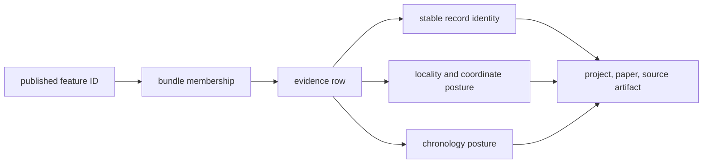
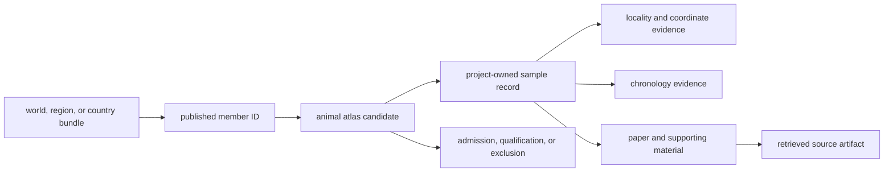
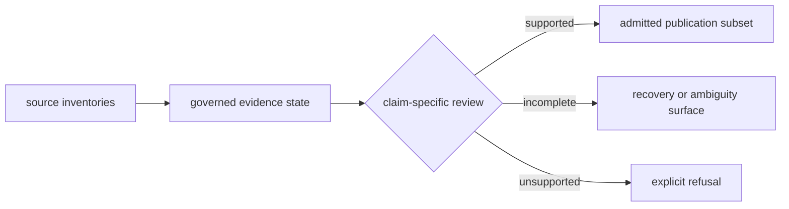

# bijux-pollenomics

<!-- bijux-pollenomics-badges:generated:start -->
[](https://pypi.org/project/bijux-pollenomics/)
[](https://github.com/bijux/bijux-pollenomics/blob/main/LICENSE)
[](https://github.com/bijux/bijux-pollenomics/actions/workflows/verify.yml?query=branch%3Amain)
[](https://github.com/bijux/bijux-pollenomics/actions/workflows/release-pypi.yml)
[](https://github.com/bijux/bijux-pollenomics/actions/workflows/release-ghcr.yml)
[](https://github.com/bijux/bijux-pollenomics/actions/workflows/release-github.yml)
[](https://github.com/bijux/bijux-pollenomics/actions/workflows/deploy-docs.yml)
[](https://github.com/bijux/bijux-pollenomics/releases)
[](https://github.com/bijux?tab=packages&repo_name=bijux-pollenomics)
[](https://github.com/bijux/bijux-pollenomics/tree/main/packages)

[](https://pypi.org/project/bijux-pollenomics/)
[](https://pypi.org/project/pollenomics/)

[](https://github.com/bijux/bijux-pollenomics/pkgs/container/bijux-pollenomics%2Fbijux-pollenomics)
[](https://github.com/bijux/bijux-pollenomics/pkgs/container/bijux-pollenomics%2Fpollenomics)

[](https://bijux.io/bijux-pollenomics/public/pollenomics/)
[](https://bijux.io/bijux-pollenomics/public/pollenomics/)
<!-- bijux-pollenomics-badges:generated:end -->

`bijux-pollenomics` is a curated evidence and publication system for pollen,
palaeoenvironmental context, archaeology, hydrography, field observations, and
ancient DNA. It preserves source identity, normalization rules, review state,
and publication lineage in one checked-in repository so a visible map point can
be traced back to the files and decisions that support it.

The database is part of the product. Source-family contracts distinguish raw,
normalized, reviewed, and published layers; fact-ownership records identify
which artifact governs a repeated claim; and the animal aDNA source library
preserves project dossiers, supporting-material inventories, sample identity,
locality evidence, chronology evidence, ambiguity ledgers, and publication
gates. Public reports are derived views over that curated state, not an
independent database.

World, Europe-plus, Nordic, and country outputs form one publication family.
Pollen and environmental context are the strongest current surfaces. Animal
aDNA remains deliberately conservative: records without adequate sample,
locality, chronology, or coordinate support stay qualified or excluded rather
than being promoted through a visually clean atlas.



The trust boundary is explicit:

| Layer | Governs | Does not govern |
| --- | --- | --- |
| source capture | acquired identity, retrieval context, and source bytes | repository interpretation |
| normalized evidence | stable fields, identifiers, and source linkage | publication eligibility |
| review | precision, conflicts, comparability, and refusal | source-native facts |
| publication | admitted records, geography, labels, and visible caveats | upstream evidence truth |

A map or report is therefore an index into governed evidence, not a substitute
for it.

## What A Published Record Contains

A public feature is a compound claim. Its visual geometry is only one member
of the record; identity, source lineage, temporal posture, spatial precision,
product scope, and admission outcome travel with it.

| Claim component | Governing evidence | Typical failure mode |
| --- | --- | --- |
| identity | stable source, project, sample, site, or registry identifier | conflated or duplicated records |
| origin | source version, retrieval metadata, artifact locator, and content hash | a citation without recoverable source material |
| place | reported locality, site relationship, coordinate basis, and precision | a broad place rendered as an exact point |
| time | source wording, normalized interval, dating basis, and comparability | contextual time presented as a sample date |
| role | direct evidence, context, decision support, or framing | co-located layers treated as equivalent proof |
| publication | geography, product version, gate result, and visible caveat | presentation silently strengthening upstream evidence |



This decomposition is why the repository contains more than map-ready tables.
The curation database records rejected precision, unresolved evidence,
conflicting claims, and source-recovery gaps so publication can remain smaller
than collection without becoming opaque.

This repository publishes `2` packages. Each release tag builds one staged
bundle, uploads the Python distribution to PyPI, publishes the release bundle
to its exact GHCR package page under the `bijux` account, and attaches the
same staged assets to the GitHub Release.

## Follow One Result End To End

Begin with the product manifest, not the rendered marker. For an admitted
animal ancient-DNA point, the review route is:



Each hop answers a different question. The bundle establishes product scope;
the candidate establishes why the record may be plotted; the sample record
owns identity; place and time records own supported precision; the literature
chain establishes provenance; and the decision explains visibility. Skipping
one hop creates familiar but unsafe shortcuts such as treating project
geography as sample geography or a paper date as sample chronology.

The same method works in the opposite direction. Start with a changed source
capture, compare normalized identities and curation decisions, then identify
which publication memberships changed. A source refresh that produces no
public diff is still an interpretable outcome when the contract explains why.

| If you need to… | Begin with… | Then verify… |
| --- | --- | --- |
| understand a visible point | bundle manifest and member ID | evidence owner, source lineage, precision, and caveats |
| explain an absent candidate | exclusion, ambiguity, and recovery surfaces | product scope and missing governing evidence |
| compare evidence families | source-family roles and observation units | temporal and spatial bridge, denominator, and limits |
| evaluate a lake priority | ranking manifest and sensitivity output | contextual inputs, field constraints, and refusal boundaries |
| assess a source refresh | capture identity and normalized member diff | curation, coverage, and affected publication membership |

## Checked-In Evidence Snapshot

The current repository state is substantial but deliberately uneven:

| Governed surface | Current checked-in scale | What the number means |
| --- | ---: | --- |
| source families | 7 | AADR, boundaries, LandClim, Neotoma, RAÄ, SEAD, and SVAR are separately captured and governed |
| LandClim | 492 site sequences and 88 grid cells | primary pollen and vegetation context |
| Neotoma | 200 sites | independent pollen context with uneven chronology support |
| SEAD | 2,172 normalized sites | archaeology context without numeric intervals in the current capture |
| RAÄ | 761,917 published sites | Sweden-specific heritage density context |
| SVAR | 40,565 lakes | candidate-lake identity and hydrographic framing |
| animal aDNA curation | 868 recovered samples across 40 projects | recovered identity rows, not proof of complete project recovery |
| animal publication | 234 reviewed point-evidence rows | the admitted spatial subset; 233 use supplementary coordinates and one uses qualified named-site geocoding |

Counts from unlike surfaces are not additive. A pollen sequence, archaeology
site, lake registry row, animal sample, and publication point answer different
questions and retain different admission rules.



The difference between 868 recovered animal samples and 234 published point
rows is not unexplained loss. It is the visible effect of evidence ownership,
spatial resolution, temporal posture, source recovery, and product admission.

## Choose A Starting Point

| Question | Start here |
| --- | --- |
| What is the product and what can it support? | [Documentation home](https://bijux.io/bijux-pollenomics/) |
| Which source and evidence rules support a public claim? | [Data system guide](docs/public/pollenomics-data/index.md) |
| What has actually been published? | [Report portal](docs/report/index.md) |
| How should a visible map point be interpreted? | [Nordic atlas guide](docs/public/nordic-atlas/index.md) |
| How were Sweden lake priorities derived? | [Sweden lake priorities](docs/public/nordic-atlas/sweden-lake-priorities/index.md) |
| Which claims remain blocked or qualified? | [Release-readiness refusal](docs/report/repository_final_release_refusal.md) |
| How is repository-owned state operated? | [Maintainer handbook](docs/internal/maintain/index.md) |

## What This Repository Produces

Today, the checked-in repository produces these durable outcomes:

- a tracked `data/` tree with source-family ownership and normalized outputs
- machine-readable source-family, evidence-stage, artifact, and fact-ownership
  contracts
- an animal aDNA curation library with project dossiers, sample-level evidence,
  manual review queues, and explicit release guards
- a report tree under `docs/report/` with world, regional, and country publication families
- governed world, Europe-plus, and Nordic map surfaces that share one publication contract
- country bundles for Sweden, Norway, Finland, and Denmark that remain filtered descendants of the same broader evidence state
- point-traceability, subset-validation, scientific-review, and exclusion
  surfaces beside the visual publications they qualify
- a MkDocs documentation site that builds into `artifacts/root/docs/site/`
- maintainer-facing review surfaces that keep final-release claims blocked
  while animal recovery and SEAD comparability remain materially weaker than
  the rest of the product

The durable product is therefore a **database, decision record, and
publication system together**. Removing the review and refusal surfaces would
make the maps easier to browse but materially less trustworthy.

## Which Package To Install

Choose the package by ownership, not by name length:

- install `bijux-pollenomics` when you want the canonical runtime, CLI, and
  Python entrypoints that own collection, normalization, reporting, and atlas
  generation
- install `pollenomics` when you want the shorter package name and CLI command
  but still expect the same runtime behavior under the hood
- use `bijux-pollenomics-dev` only for maintainer checks, docs integrity, and
  release-support workflows inside this repository

## Package Map

The `2` publishable packages in this repository are:

| Package | Role | Links |
| --- | --- | --- |
| `bijux-pollenomics` | Runtime package for tracked data collection, report publication, and atlas generation | <a href="https://pypi.org/project/bijux-pollenomics/"></a> <a href="https://bijux.io/bijux-pollenomics/public/pollenomics/"></a> <a href="https://github.com/bijux/bijux-pollenomics/pkgs/container/bijux-pollenomics%2Fbijux-pollenomics"></a> <a href="https://github.com/bijux/bijux-pollenomics/tree/main/packages/bijux-pollenomics"></a> |
| `pollenomics` | Compatibility alias package that re-exports the runtime API and provides the `pollenomics` CLI command | <a href="https://pypi.org/project/pollenomics/"></a> <a href="https://bijux.io/bijux-pollenomics/public/pollenomics/"></a> <a href="https://github.com/bijux/bijux-pollenomics/pkgs/container/bijux-pollenomics%2Fpollenomics"></a> <a href="https://github.com/bijux/bijux-pollenomics/tree/main/packages/pollenomics"></a> |

## Capability Boundaries

The current repository scope is deliberately narrower than the full
cross-evidence pollenomics runtime it is aiming toward.

What exists today:

- AADR is used from public `.anno` metadata files
- boundaries, LandClim, Neotoma, SEAD, and RAÄ are collected into tracked `data/` subtrees
- world, regional, and country report bundles are rebuilt from local commands and checked in
- the maps are publication artifacts for inspection, not analysis engines
- Sweden lake ranking artifacts and shortlist overlays can be emitted from the
  checked-in atlas context and published report packet, but they remain
  decision-support outputs rather than a substitute for field verification or a
  finished scientific scoring engine

What does not exist today:

- AADR genotype processing from `.geno`, `.ind`, or `.snp`
- lake-intersection analysis
- full archaeological-site scoring across the complete evidence tree
- automated sampling recommendations
- integrated eDNA, aDNA, pollen, and archaeological co-analysis runtime
- paper-grade statistical workflows for the planned POLLENOMIC's series

## Evidence Maturity

The publication architecture is broader than the maturity of every scientific
layer. That difference is intentional and visible:

| Surface | Current posture |
| --- | --- |
| pollen and palaeoenvironmental context | established collection and publication routes |
| boundaries and hydrography | geographic framing and lake-registry context, not independent scientific weight |
| human ancient DNA | versioned AADR metadata context; genotype processing is out of scope |
| animal ancient DNA | evidence-preserving recovery with conservative exact-point admission |
| lake ranking | reproducible decision support that still requires bathymetry, access, permits, and field verification |

Expansion is acceptable only when it retains source identity, domain-specific
semantics, and reviewable refusal. A larger atlas with weaker evidence would be
a regression.

## Working With Commands

The root `Makefile` is the main local interface. Some targets only validate the checkout, while others rewrite tracked files.

Validation-first targets:

- `make install` creates or updates the editable environment under `artifacts/root/check-venv/`
- `make lock-check`, `make lint`, `make test`, `make api`, `make docs`, `make package-verify`, and `make check` verify the repository without rewriting tracked data or report outputs

State-changing targets:

- `make lock` rewrites `uv.lock`
- `make data-prep` rewrites tracked source outputs under `data/`
- `make reports` rewrites tracked publication outputs under `docs/report/`
- `make app-state` runs the full rebuild path and rewrites tracked data, tracked reports, and the local docs build

If your goal is only to validate the repository, stop at the verification
targets. Do not start with `make app-state` unless you intentionally want to
rewrite tracked repository outputs.

## Quick Start

### Verify A Fresh Checkout

Prerequisites: `python3.11` and `uv` must be available locally.

```bash
python3.11 --version
uv --version
make install
artifacts/root/check-venv/bin/bijux-pollenomics --version
make lock-check
make lint
make test
make package-verify
make docs
```

This is the safest first run because it proves the editable environment, test surface, packaging surface, and docs build before any tracked data or report tree is regenerated.

### Rebuild The Checked-In Repository State

Use the explicit sequence when you want reviewable rebuild steps:

```bash
make data-prep
make reports
make docs
```

Use `make app-state` when you want that same sequence as a single convenience target.

Expect the rebuild path to take longer than lint and tests, to require network access, and to overwrite generated files that are intentionally checked in.

## Common Workflows

- `make install` syncs the editable environment from the tracked `uv.lock`
- `make check` runs the main repository verification pass: lock check, lint, tests, docs, and distribution verification
- `make data-prep` runs `collect-data all --version v66 --output-root data`
- `make reports` runs `publish-reports --aadr-root data/aadr --version v66 --output-root docs/report --context-root data`
- `make app-state` runs the full rebuild path: data, reports, and docs
- `make docs-serve` serves the docs locally at `http://127.0.0.1:8000/`
- `make clean` removes transient virtualenv, packaging, and cache artifacts

## Local Artifact Contract

- transient local outputs belong under `artifacts/`, not as ad hoc root-level
  cache or build directories
- the shared root environment lives at `artifacts/root/check-venv/`
- the MkDocs site builds to `artifacts/root/docs/site/`

For exact CLI expansions, narrower test targets, and package troubleshooting targets, use [entrypoints and examples](https://bijux.io/bijux-pollenomics/public/pollenomics/interfaces/entrypoints-and-examples/) and [common workflows](https://bijux.io/bijux-pollenomics/public/pollenomics/operations/common-workflows/).

The narrower verification and packaging targets remain available when you need them: `make test-unit`, `make test-regression`, `make test-e2e`, `make package-check`, `make package-smoke`, and `make package-source-smoke`.

## Repository Layout

Treat the top-level paths by ownership and review expectations:

- `Makefile` is the main local interface for verification, rebuilds, docs, and packaging
- `pyproject.toml` and `uv.lock` define and lock the Python environment
- `data/` contains tracked source snapshots, normalized outputs, and the collection manifest
- `docs/report/` contains the public publication tree, including world,
  regional, country, review, caveat, and maintainer-facing release-readiness
  surfaces
- `docs/` contains the canonical narrative and reference documentation that explains the checked-in outputs
- `packages/bijux-pollenomics/src/` contains the CLI, collectors, and report publishing logic
- `packages/bijux-pollenomics/tests/` contains unit, regression, and end-to-end coverage
- `artifacts/` contains transient local outputs such as `.venv/`, `dist/`, and the built docs site

Key checked-in contract files:

- `packages/bijux-pollenomics/src/bijux_pollenomics/config.py` centralizes publication defaults such as the current AADR version
- `apis/bijux-pollenomics/v1/` contains the checked-in public API contract, pinned canonical JSON, and schema digest
- `packages/bijux-pollenomics/src/bijux_pollenomics/data_downloader/contracts.py` and `packages/bijux-pollenomics/src/bijux_pollenomics/reporting/bundles/paths.py` centralize file and directory naming contracts

## Published Outputs

The main checked-in publication artifacts are:

- report portal: [`docs/report/index.md`](docs/report/index.md)
- world surface: [`docs/report/world/world_map.html`](docs/report/world/world_map.html)
- Europe-plus surface: [`docs/report/regions/europe-plus/europe-plus_map.html`](docs/report/regions/europe-plus/europe-plus_map.html)
- Nordic surface: [`docs/report/regions/nordic/nordic_map.html`](docs/report/regions/nordic/nordic_map.html)
- published report manifest: [`docs/report/published_reports_summary.json`](docs/report/published_reports_summary.json)
- data collection manifest: [`data/collection_summary.json`](data/collection_summary.json)
- country bundles under `docs/report/countries/`
- release-readiness caveats: [`docs/report/repository_final_release_refusal.md`](docs/report/repository_final_release_refusal.md)

Important output limits:

- the visible maps are inspectable publication artifacts, not site-selection engines
- the published map bundles local Leaflet assets, but basemap tiles still come from external providers at runtime
- RAÄ coverage is Sweden-only
- final release language remains refused while animal recovery and SEAD comparability stay below the stronger repository surfaces
- country reports are file bundles and summaries, not standalone web applications

## Documentation

The MkDocs site separates public scientific and product explanations from
operator material. Public pages explain sources, evidence, publications,
maps, and fieldwork. Internal pages cover repository operation, validation,
and release ownership.

- docs home: [`docs/index.md`](docs/index.md)
- runtime package handbook: [`docs/public/pollenomics/index.md`](docs/public/pollenomics/index.md)
- package operations guide: [`docs/public/pollenomics/operations/index.md`](docs/public/pollenomics/operations/index.md)
- package interface reference: [`docs/public/pollenomics/interfaces/index.md`](docs/public/pollenomics/interfaces/index.md)
- data reference: [`docs/public/pollenomics-data/index.md`](docs/public/pollenomics-data/index.md)
- fieldwork reference: [`docs/public/fieldwork/lyngsjon-lake-fieldwork/index.md`](docs/public/fieldwork/lyngsjon-lake-fieldwork/index.md)
- internal guide: [`docs/internal/index.md`](docs/internal/index.md)
- maintainer handbook: [`docs/internal/maintain/index.md`](docs/internal/maintain/index.md)

## Working Rules

These behaviors matter in review:

- collectors replace source-specific output directories before rewriting them, so reruns are intentionally destructive to stale generated files
- `data/` and `docs/report/` are tracked outputs that should change only when the corresponding rebuild intent is explicit
- `artifacts/` is disposable local state and should not be treated as a publication surface
- this README should describe only commands, outputs, and limits that exist in the current repository state
- if a change rewrites generated artifacts, review those diffs together with any narrative or workflow updates that explain them

## License

This repository is licensed under the Apache License 2.0. Copyright 2026 Bijan Mousavi <bijan@bijux.io>. See [`LICENSE`](LICENSE) and [`NOTICE`](NOTICE).
