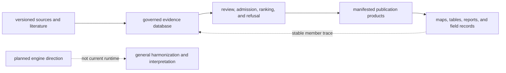
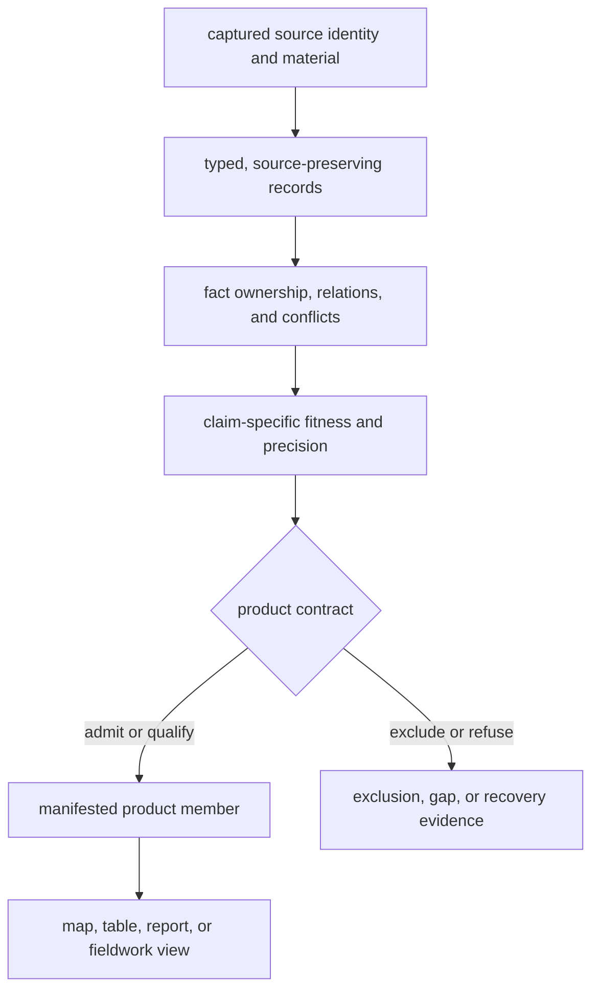
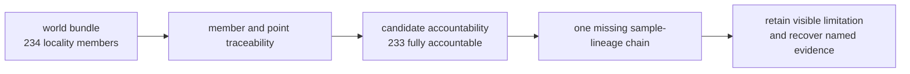

# bijux-pollenomics

`bijux-pollenomics` is a curated evidence and publication system for
pollen, palaeoenvironmental context, archaeology, hydrography, field
observations, and ancient DNA. It preserves the path from a source object to a
normalized record, scientific decision, publication member, and visible map or
report.

The database is part of the product. The Python package supplies collection,
normalization, review, ranking, and publication behavior; the checked-in
`data/` tree supplies governed evidence state; and `docs/report/` contains
manifested products derived from that evidence. None of those three identities
can stand in for the others.

<!-- bijux-pollenomics-badges:generated:start -->
[](https://pypi.org/project/bijux-pollenomics/)
[](https://github.com/bijux/bijux-pollenomics/blob/main/LICENSE)
[](https://github.com/bijux/bijux-pollenomics/actions/workflows/verify.yml?query=branch%3Amain)
[](https://github.com/bijux/bijux-pollenomics/actions/workflows/release-pypi.yml)
[](https://github.com/bijux/bijux-pollenomics/actions/workflows/release-ghcr.yml)
[](https://github.com/bijux/bijux-pollenomics/actions/workflows/release-github.yml)
[](https://github.com/bijux/bijux-pollenomics/actions/workflows/deploy-docs.yml)
[](https://github.com/bijux/bijux-pollenomics/releases)
[](https://github.com/bijux?tab=packages&repo_name=bijux-pollenomics)
[](https://github.com/bijux/bijux-pollenomics/tree/main/packages)

[](https://pypi.org/project/bijux-pollenomics/)
[](https://pypi.org/project/pollenomics/)

[](https://github.com/bijux/bijux-pollenomics/pkgs/container/bijux-pollenomics%2Fbijux-pollenomics)
[](https://github.com/bijux/bijux-pollenomics/pkgs/container/bijux-pollenomics%2Fpollenomics)

[](https://bijux.io/bijux-pollenomics/public/pollenomics/)
[](https://bijux.io/bijux-pollenomics/public/pollenomics/)
<!-- bijux-pollenomics-badges:generated:end -->

## Product Boundary

The implemented product mode is `atlas_builder`. It collects named source
families, prepares family-specific evidence, records qualifications and
refusals, ranks declared decision-support populations, and publishes world,
regional, country, Nordic-atlas, and fieldwork surfaces.

General multi-evidence harmonization, evidence-aware interpretation, and
workflow replay remain project direction. They are not presented as current
runtime capabilities. The machine-readable boundary is available through:

```bash
bijux-pollenomics product-scope --json
bijux-pollenomics surface-map --json
```



The installed distribution and the repository checkout answer different
questions. The distribution supplies executable behavior; the checkout adds a
particular governed evidence revision and its publication descendants.

| Surface in hand | What can be established | What must be supplied separately |
| --- | --- | --- |
| installed `bijux-pollenomics` wheel | command and Python contracts, schemas, collectors, validation, and publication behavior | governed `data/` state and checked-in `docs/report/` products |
| repository `data/` tree | captured, prepared, reviewed, excluded, and recovery state for one revision | the producer version and any selected publication membership |
| repository `docs/report/` tree | manifested members, traceability, qualifications, and renderings for named products | upstream evidence authority and the runtime that produced the descendants |

Consequently, “the current result” is never identified by a package version
alone. A reproducible citation records the producer version, the evidence
revision, and the product manifest or member identity.

## What Makes A Result Reusable

A consequential result carries four linked identities:

| Identity | Fixes | Typical authority |
| --- | --- | --- |
| source | which release, paper, archive member, response, or registry row entered the system | capture manifest, DOI, accession, native key, or content digest |
| evidence | which governed object owns identity, place, time, taxonomy, and relations | normalized record, sample, locality, chronology, coordinate, or relation |
| decision | why the object was admitted, qualified, excluded, ranked, or refused for one use | review, conflict, readiness, ranking, or admission record |
| product | which declared scope contains the visible member | bundle manifest, stable member ID, geography, and publication version |

A package version identifies producer behavior, not an evidence snapshot. A
data revision identifies governed state, not a selected product. A rendered
point identifies neither. Preserve the full envelope when reusing a feature,
count, comparison, exclusion, or ranking.

## Choose A Starting Point

| Question | Start here | Identity to retain |
| --- | --- | --- |
| What does the product implement? | [Pollenomics handbook](docs/public/pollenomics/index.md) | runtime version and product-scope contract |
| What does a database object mean? | [domain language](docs/public/pollenomics-data/domain-language.md) | object type, stable ID, and claim dimension |
| How was evidence prepared? | [data-system overview](docs/public/pollenomics-data/overview/data-system-overview.md) | source family, captured member, and data revision |
| Why was a record admitted or refused? | [curation guide](docs/public/pollenomics-data/curation/index.md) | decision ID, proposed use, disposition, and reason |
| What belongs to a publication? | [publication model](docs/public/pollenomics-data/publications/index.md) | manifest, member ID, geography, and caveat |
| How should an atlas marker be interpreted? | [Nordic Evidence Atlas](docs/public/nordic-atlas/index.md) | feature ID, evidence role, space, and time posture |
| What supports a lake priority? | [Sweden lake priorities](docs/public/nordic-atlas/sweden-lake-priorities/index.md) | candidate ID, ranking scenario, and readiness state |
| What does a field visit establish? | [fieldwork evidence](docs/public/fieldwork/index.md) | visit identity, date, location, and media lineage |
| Which limitation blocks stronger release language? | [release refusal](docs/report/repository_final_release_refusal.md) | refused claim and governing evidence dimension |
| How is tracked state operated safely? | [maintainer handbook](docs/internal/maintain/index.md) | owner, explicit roots, prior manifest, and verification |

Choose by claim rather than file format. JSON, CSV, GeoJSON, Markdown, and HTML
are representations of governed objects or products; their extensions do not
tell you which layer owns the meaning.

## Inspect Before Rebuilding

Install the canonical runtime on Python 3.11 or newer:

```bash
python3.11 -m pip install bijux-pollenomics
bijux-pollenomics --version
```

The wheel contains runtime behavior and schemas. It does not contain this
repository's evidence database or published report tree. From a repository
checkout, begin with read-only contracts and a checked-in manifest:

```bash
uv run --project packages/bijux-pollenomics bijux-pollenomics product-scope --json
uv run --project packages/bijux-pollenomics bijux-pollenomics source-support --json
uv run --project packages/bijux-pollenomics bijux-pollenomics adna-species --json
python3 -m json.tool docs/report/world/world_bundle.json | head -80
```

| Inspection | Establishes | Does not establish |
| --- | --- | --- |
| product scope | implemented and explicitly planned capability boundaries | fitness of the checked-in evidence |
| source support | collector capability for named families | capture presence, completeness, or publication membership |
| species inventory | registered animal evidence surfaces | source recovery or release readiness |
| world bundle | identity and members of one published scope | completeness of upstream collection or eligibility elsewhere |

Continue from a manifest member to its evidence and decision records. Run a
writer only when the intended governed roots and review boundary are explicit.

## Evidence Roles

Pollen and palaeoenvironmental evidence lead the scientific model. Other
families contribute direct evidence, environmental or archaeological context,
sampling context, and geographic framing without becoming interchangeable.

| Family | Contracted role | Principal boundary |
| --- | --- | --- |
| LandClim and Neotoma | primary pollen and vegetation context | site sequences, samples, and model cells retain different observation units |
| SEAD and RAÄ | environmental-archaeology context | context density or proximity is not sample proof or contemporaneity |
| SMHI SVAR | lake and hydrography context | registry presence and representative geometry do not establish coring suitability |
| AADR | release-versioned human aDNA evidence | panel rows require governed identity resolution before person or sample counts |
| animal aDNA | literature-backed, sample-owned evidence | locality, chronology, and coordinates require recoverable sample-level support |
| boundaries | publication framing | modern geometry supplies scope, not scientific weight or historical affiliation |
| fieldwork | direct visit observation | a visit record does not validate nearby evidence or establish sampling suitability |

The current animal aDNA and SEAD surfaces remain deliberately conservative:
records without adequate sample, locality, chronology, or coordinate support
stay qualified or excluded. Missing evidence and unavailable comparability
remain visible as recovery work or release refusal.

## Database And Publication State



`data/` owns captured, normalized, curated, and reviewed evidence. Different
source families materialize different lifecycle stages; a downstream product
does not prove that an absent upstream stage exists. `docs/report/` owns
derived product state. Its manifests identify membership, while its member
records retain links to the evidence and decisions that justify publication.

The [data repository guide](data/README.md) maps tracked paths to authority.
The [database model](docs/public/pollenomics-data/database/index.md) explains
objects, relations, revisions, and coherent read sets.

## Audit A Checked-In Publication Boundary

The world bundle currently declares 234 animal locality members. The candidate
accountability surface evaluates the same 234 identities and reports 233 as
fully accountable; the remaining dromedary-camel candidate has site,
chronology, and coordinate evidence but lacks sample-lineage evidence. This is
not a count discrepancy to smooth over. It is a concrete example of a visible
product member whose evidence packet does not satisfy every accountability
dimension.



Inspect the boundary directly:

```bash
jq '{total: .animal_atlas.total_locality_points}' \
  docs/report/world/world_bundle.json
jq '{candidates: .candidate_row_count, accountable: .passed_row_count, ok: .overall_ok}' \
  data/adna/final/atlas/animal_atlas_candidate_accountability.json
jq '.rows[] | select(.fully_accountable == false)' \
  data/adna/final/atlas/animal_atlas_candidate_accountability.json
```

The right response is to preserve the publication identity, the failed
accountability dimension, and its recovery condition together. Deleting the
row would hide collected evidence; treating the map point as proof of complete
lineage would overstate it.

## Packages

| Distribution | Responsibility | Intended audience |
| --- | --- | --- |
| [`bijux-pollenomics`](packages/bijux-pollenomics/README.md) | canonical runtime, Python namespace, and command | users, operators, and integrators |
| [`pollenomics`](packages/pollenomics/README.md) | short executable and import compatibility surface | users who prefer the concise name |
| [`bijux-pollenomics-dev`](packages/bijux-pollenomics-dev/README.md) | repository, documentation, API-freeze, and release checks | repository maintainers |

The two public distributions execute one canonical scientific runtime. The
short name does not own separate schemas, evidence, or publication behavior.
The maintainer package observes repository contracts; it does not make
scientific decisions.

## Repository Workflows

Create the locked environment and run the focused default checks:

```bash
make install
artifacts/root/check-venv/bin/bijux-pollenomics --version
make check
```

State-changing workflows are intentionally separate:

```bash
make data-prep   # collect and prepare governed data state
make reports     # publish governed report products
make app-state   # rebuild data, reports, and documentation state
```

These commands can replace owned generated trees. Review source identity,
member identity, semantic changes, population changes, exclusions, and
manifest changes—not only file counts or successful exit status. All
transient local outputs belong under `artifacts/`; the locked check environment
belongs under `artifacts/root/check-venv/`, and the local documentation site
belongs under `artifacts/root/docs/site/`. Governed evidence and publications
belong only in their declared tracked roots.

The local documentation gate is:

```bash
make docs-check
```

Use the focused lane that matches the changed contract:

| Contract | Focused command |
| --- | --- |
| locked environment | `make lock-check` |
| package metadata and build | `make package-check` |
| installed package behavior | `make package-verify` |
| source-distribution installation | `make package-source-smoke` |
| unit behavior | `make test-unit` |
| repository contracts | `make test-regression` |
| end-to-end workflows | `make test-e2e` |

Slow and aggregate lanes remain available through the Make interface, but
they are not substitutes for the owner-specific check closest to a changed
contract.

## Repository Map

| Path | Authority |
| --- | --- |
| `data/` | tracked source, normalized, curation, review, and evidence state |
| `docs/report/` | generated, manifested publication and review products |
| `docs/public/` | reader-facing product, evidence, atlas, and fieldwork explanations |
| `docs/internal/` | repository operation, validation, generation, and release ownership |
| `packages/bijux-pollenomics/` | canonical runtime and its tests |
| `packages/pollenomics/` | short-name compatibility distribution |
| `packages/bijux-pollenomics-dev/` | maintainer checks and release support |
| `apis/bijux-pollenomics/v1/` | frozen public API contract and digest |
| `artifacts/` | disposable local build, test, and rehearsal output |

## Current Scientific Limits

The repository publishes qualification and refusal surfaces alongside its
successful products. In particular:

- animal source recovery is not yet sufficiently region-agnostic for final
  release wording;
- SEAD chronology and bibliography remain too thin for temporal-comparison
  claims;
- RAÄ is Sweden-specific and cannot imply equivalent Nordic archaeology
  coverage;
- boundary geometry frames publication scope but adds no scientific support;
- lake rankings are decision support, not field-readiness or coring-site
  selection; and
- spatial proximity and interval overlap do not establish association,
  contemporaneity, or causation.

Start with the [report portal](docs/report/index.md) for checked-in products
and their current review posture.

## Contributing, Security, And License

Read [CONTRIBUTING.md](CONTRIBUTING.md) before changing governed state or
package contracts. Report vulnerabilities through the private process in
[SECURITY.md](SECURITY.md), not a public issue.

This repository is licensed under the Apache License 2.0. Copyright 2026 Bijan
Mousavi <bijan@bijux.io>. See [LICENSE](LICENSE) and [NOTICE](NOTICE).
