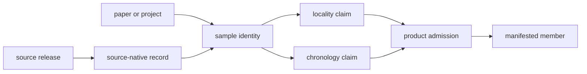

# Pollenomics Data Repository

`data/` is the governing evidence state for Pollenomics. It contains tracked
source captures, normalized records, scientific review surfaces, and curated
ancient-DNA evidence. Files under `docs/report/` are derived publications over
this state; they do not replace it as the authority for a scientific claim.

## Evidence Layers

```text
data/
├── collection_summary.json
├── source_family_contracts.json
├── source_family_evidence_stage_matrix.json
├── source_fact_ownership_registry.json
├── evidence_artifact_contracts.json
├── aadr/
├── boundaries/
├── landclim/
├── neotoma/
├── raa/
├── sead/
├── svar/
└── adna/
    ├── governance/
    │   └── source_library/
    ├── species/
    └── final/
```

Each contracted source family is represented through four roles where
applicable:

1. **raw** preserves acquired source identity and material;
2. **normalized** stores repository-owned fields and geometry;
3. **reviewed** records fitness, conflicts, caveats, and coverage; and
4. **published** identifies the derived report or atlas surface.

`source_family_contracts.json` declares the expected paths and purpose of those
layers. `source_family_evidence_stage_matrix.json` records their evidence
posture. `collection_summary.json` binds the collected source version,
retrieval metadata, hashes, output roots, provenance, and replacement policy.

## Source Families

| Root | Evidence role |
| --- | --- |
| `landclim/` | pollen-site and REVEALS model context |
| `neotoma/` | palaeoecological pollen-site context |
| `sead/` | environmental archaeology context |
| `raa/` | Sweden-specific archaeology and heritage context |
| `boundaries/` | geographic filtering and framing |
| `svar/` | Swedish lake and hydrography context |
| `aadr/` | versioned human ancient-DNA metadata capture |
| `adna/` | species-owned human and animal ancient-DNA evidence |

These roots are not interchangeable. Their temporal resolution, spatial
precision, licensing, coverage, and scientific role remain source-specific.

## Evidence Graph And Cardinality

The data model is relational even when an artifact is serialized as a flat
table. Keys identify durable objects; explicit relations state how those
objects may be joined; review records preserve whether the relation is final,
qualified, conflicted, or unresolved.

| Object | Stable relation | Cardinality that must survive |
| --- | --- | --- |
| source release | owns captured artifacts and source-native records | one release to many records |
| paper or archive project | owns source context and supporting-material inventory | one project can cite several papers; one paper can describe several projects |
| sample | resolves native labels and accessions through evidence locators | one project to many samples; labels are not globally unique |
| locality claim | connects a sample or site to reported and resolved place evidence | one sample can have competing claims; one locality can serve many samples |
| chronology claim | connects source wording to any allowed normalized interval | one sample can retain several claims without collapsing their bases |
| publication member | connects one admitted evidence object to a product scope | one evidence object can enter several products under separate decisions |



Flattened exports may repeat these keys for convenience. They do not authorize
a project-wide place or date to be copied into every sample, nor a published
feature to become the owner of its upstream facts.

## Animal Ancient-DNA Curation

`adna/governance/source_library/` is the source-accountability layer for animal
ancient DNA. It contains cross-project registries and one durable subtree per
tracked archive project. A project subtree can include:

- an intake dossier and bundle manifest;
- archived source metadata and acquisition metadata;
- a stable sample master;
- sample-to-site linkage;
- locality worksheets and locality evidence;
- chronology, chronology evidence, and chronology provenance; and
- a curation note recording project-specific interpretation.

Paper-owned supporting material is tracked separately from archive-project
metadata so a publication, project accession, supplement, sample, and site are
not collapsed into one identifier.

Cross-project ambiguity, missing-source, chronology, locality, coordinate, and
coverage surfaces remain under `adna/governance/`. They preserve unresolved
work as evidence instead of silently deleting incomplete rows.

## Species And Publication Views

`adna/species/<latin_name>/` groups curated records into species-owned raw,
normalized, manifest, report, and review surfaces. The human root links to the
governed AADR capture; animal roots derive from the source library.

The checked-in species roots make the collection breadth visible:

| Root | Current role |
| --- | --- |
| `adna/species/homo_sapiens/` | human aDNA surface; `raw/aadr -> ../../../../aadr` preserves the governed AADR release rather than copying it |
| `adna/species/equus_caballus/` | horse recovery, normalization, review, and reporting |
| `adna/species/bos_taurus/` | cattle recovery, normalization, review, and reporting |
| `adna/species/canis_lupus_familiaris/` | dog recovery, normalization, review, and reporting |
| `adna/species/camelus_dromedarius/` | dromedary recovery, normalization, review, and reporting |
| `adna/species/rangifer_tarandus/` | reindeer recovery, normalization, review, and reporting |
| `adna/species/equus_asinus/` | donkey recovery, normalization, review, and reporting |
| `adna/species/felis_catus/` | cat recovery, normalization, review, and reporting |
| `adna/species/capra_hircus/` | goat recovery, normalization, review, and reporting |
| `adna/species/ovis_aries/` | sheep recovery, normalization, review, and reporting |
| `adna/species/sus_scrofa_domesticus/` | domestic pig recovery, normalization, review, and reporting |

Together these roots form a domesticated-animal curation program, not eleven
independent source databases. Project and paper evidence remains governed in
`adna/governance/source_library/`; species roots expose reproducible views over
that evidence for comparison, readiness review, and publication.

`adna/final/` contains admitted downstream inputs:

- `atlas/animal_atlas_point_candidates.json` for animal atlas candidates;
- `atlas/animal_atlas_candidate_accountability.json` for admission accounting;
  and
- `countries/country_publication_index.json` for country publication linkage.

These are final inputs to publication, not final scientific truth. Their rows
remain subordinate to the governing project and sample evidence identified by
`source_fact_ownership_registry.json`.

## Refresh Safety

Source collection uses staging-and-swap replacement. A successful refresh
replaces a source-specific tracked root; a failed refresh preserves the prior
root. Running `make data-prep` is therefore an intentional tracked-data rewrite,
not a read-only validation command.

Review source identity, hashes, counts, evidence posture, and downstream report
diffs together after a refresh. A newer source can narrow a claim when it
reveals conflicts or weaker support.

## Further Reading

- [Data system](../docs/public/pollenomics-data/index.md)
- [Data architecture](../docs/public/pollenomics-data/overview/data-architecture-handbook.md)
- [Directory and authority model](../docs/public/pollenomics-data/overview/data-directory-layout.md)
- [Source families](../docs/public/pollenomics-data/sources/index.md)
- [Animal source intake](../docs/public/pollenomics-data/sources/animal-source-intake.md)
- [Evidence chain](../docs/public/pollenomics-data/evidence/index.md)
- [Publication model](../docs/public/pollenomics-data/publications/index.md)
