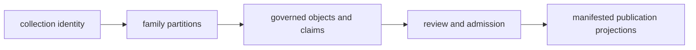

# Pollenomics Data Repository

`data/` is the governing evidence state for Pollenomics. Tracked source
data and governed species-owned ancient-DNA views live directly under
`data/`; publications under `docs/report/` are derived projections and
do not replace this state as authority for a scientific claim.

## Evidence Layout

```text
data
├── adna
│   ├── species
│   │   ├── equus_caballus
│   │   ├── sus_scrofa_domesticus
│   │   ├── ovis_aries
│   │   ├── bos_taurus
│   │   ├── capra_hircus
│   │   ├── canis_lupus_familiaris
│   │   ├── felis_catus
│   │   ├── camelus_dromedarius
│   │   ├── rangifer_tarandus
│   │   ├── equus_asinus
│   │   └── homo_sapiens
│   │       ├── raw
│   │       │   └── aadr -> ../../../../aadr
│   │       ├── normalized
│   │       ├── manifests
│   │       ├── reports
│   │       └── review
│   ├── governance
│   │   └── source_library
│   └── final
├── aadr
│   └── v66
├── boundaries
├── landclim
├── neotoma
├── raa
├── sead
└── svar
```

Each contracted family can carry four materially different roles: raw capture,
normalized evidence, scientific review, and publication. Directory presence
does not establish that a role contains governed members. Inspect the
evidence-stage matrix and the actual artifacts before claiming a complete
lifecycle.

## Database Contract Map

| Registry | Governs | Must not be used as |
| --- | --- | --- |
| `collection_summary.json` | collected roots, versions, acquisition, hashes, and replacement | a catalogue of every evidence record |
| `source_family_contracts.json` | family role and lifecycle ownership | record-level scientific fitness |
| `source_family_evidence_stage_matrix.json` | material lifecycle presence and family-scale metrics | a universal maturity score |
| `source_spatiotemporal_posture_registry.json` | family-specific spatial and temporal meaning | permission to compare unlike records |
| `source_fact_ownership_registry.json` | authority for recurring facts and dependent copies | permission to edit a convenient descendant |
| `evidence_artifact_contracts.json` | required companions for project, paper, sample, site, atlas, and country units | proof that populated values are scientifically valid |



No single registry represents the entire database, and no publication output
may feed a fact backward into its evidence owner.

## Source Families

| Root | Evidence role |
| --- | --- |
| `landclim/` | pollen-site and REVEALS model context |
| `neotoma/` | palaeoecological pollen-site context |
| `sead/` | environmental archaeology context |
| `raa/` | Sweden-specific archaeology and heritage context |
| `boundaries/` | geographic filtering and framing |
| `svar/` | Swedish lake and hydrography context |
| `aadr/` | versioned human ancient-DNA metadata capture; requested release `v66` |
| `adna/` | species-owned human and animal ancient-DNA evidence |

These roots are not interchangeable. Their temporal resolution, spatial
precision, licensing, coverage, and scientific role remain source-specific.

### Read Partial Lifecycle State

The tree is not expected to present one uniform four-directory pattern for
every family. Read the materialized artifacts before describing readiness:

| Observable state | Defensible conclusion | Unsupported conclusion |
| --- | --- | --- |
| capture only | named upstream material is retained | normalized meaning or publication fitness exists |
| capture and normalization | repository objects can be traced to source material | conflicts and precision were reviewed |
| normalization and publication, no review | a product was derived from normalized state under a declared topology | an absent review was performed implicitly |
| review and no publication | fitness was evaluated for the named use | the reviewed population was published |
| publication only among declared stage artifacts | a retained product exists | the current tree can reconstruct every upstream preparation stage |

Stage absence is a database fact. Preserve it in lifecycle audits and release
language rather than creating an empty artifact or inferring the stage from a
downstream schema.

## Evidence Graph And Cardinality

The data model is relational even when an artifact is serialized as a flat
table. Keys identify durable objects; explicit relations state how those
objects may be joined; review records preserve final, qualified, conflicted,
and unresolved claims.

| Object | Stable relation | Cardinality that must survive |
| --- | --- | --- |
| source release | owns captured artifacts and source-native records | one release to many records |
| paper or archive project | owns source context and supporting-material inventory | papers and projects are many-to-many |
| sample | resolves native labels through evidence locators | one project to many samples; labels are not globally unique |
| locality claim | connects a sample or site to reported and resolved place evidence | one sample can retain competing claims |
| chronology claim | connects source wording to an allowed normalized interval | one sample can retain several evidence bases |
| publication member | connects admitted evidence to one product scope | one object can enter several products under separate decisions |

Flattened exports may repeat keys for convenience. They do not authorize a
project-wide place or date to be copied into every sample, nor a published
feature to become the owner of upstream facts.

## Animal Ancient-DNA Curation

`adna/governance/source_library/` is the source-accountability layer for animal
ancient DNA. It keeps cross-project registries separate from one durable
subtree per archive project. A project subtree can carry an intake dossier,
bundle manifest, archived acquisition metadata, stable sample master,
sample-to-site links, locality and chronology evidence, and the curation note
that explains project-specific interpretation.

Paper-owned supporting material remains distinct from archive-project
metadata. A publication, project accession, supplement, sample, and site are
related evidence objects, not aliases for one identifier. Cross-project
ambiguity, missing-source, chronology, locality, coordinate, and coverage
surfaces stay under `adna/governance/` so incomplete work remains visible.

## Species Evidence Views

`Homo sapiens` ancient DNA is governed under
`adna/species/homo_sapiens/`. Its `raw/aadr -> ../../../../aadr` link preserves
the captured release without a copy. The current human view is capture-only:
normalized and review member artifacts are not materialized in this checkout.

The domesticated-animal curation program owns generated views under:

- `adna/species/equus_caballus/`
- `adna/species/sus_scrofa_domesticus/`
- `adna/species/ovis_aries/`
- `adna/species/bos_taurus/`
- `adna/species/capra_hircus/`
- `adna/species/canis_lupus_familiaris/`
- `adna/species/felis_catus/`
- `adna/species/camelus_dromedarius/`
- `adna/species/rangifer_tarandus/`
- `adna/species/equus_asinus/`

Project and paper evidence remains governed under
`adna/governance/source_library/project_registry.json` and its project
subtrees. The role split is declared by
`adna/governance/surface_role_registry.json`; the per-project file contract is
`adna/governance/source_library/project_surface_contract.json`.

Species roots are projections for inspection, comparison, readiness review,
and publication. They do not create eleven independent source databases or
transfer fact ownership away from projects and samples.

`adna/final/` contains admitted downstream publication inputs:

- `atlas/animal_atlas_point_candidates.json` for animal atlas candidates;
- `atlas/animal_atlas_candidate_accountability.json` for admission accounting;
  and
- `countries/country_publication_index.json` for country publication linkage.

These are final publication inputs, not final scientific truth. Their rows
remain subordinate to project- and sample-owned evidence.

## Audit One Data Claim

| Question | Required route |
| --- | --- |
| Which source object was captured? | collection identity → family root → release or project artifact → native record |
| Which sample or site is represented? | stable normalized identity → aliases and relations → captured locator |
| Who owns a repeated place or time value? | fact-ownership registry → locality or chronology claim → evidence locator |
| Why is a record visible? | eligible population → admission decision → product manifest → published member |
| Why is a known record absent? | expected identity → recovery, ambiguity, exclusion, or scope decision |
| What changed after a refresh? | capture diff → normalized diff → review diff → membership and count diff |

An audit closes only when the governing evidence and the decision connecting
it to the product are both recoverable. Finding the same value in several
files is not equivalent to finding its authority.

### Worked Accountability Join

`adna/final/atlas/animal_atlas_candidate_accountability.json` is an anti-gap
surface over the animal point population. Each row joins a final candidate to
the evidence dimensions required to account for it: sample rows, sample
lineage, site evidence, chronology evidence, coordinate provenance, and
locality agreement.

For the current dromedary-camel candidate, `sample_rows_present` is true while
`sample_lineage_present` is false. Site, chronology, and coordinate evidence
are present, so the row is neither “missing” nor “complete.” The defensible
state is a known candidate with a failed lineage dimension.

| Surface | What it contributes | What it cannot decide alone |
| --- | --- | --- |
| final atlas candidate | stable proposed product identity | whether all evidence dimensions resolve |
| accountability row | dimension-by-dimension presence and locators | whether missing evidence can be inferred |
| project or paper evidence | recovered source material and relations | final product membership |
| world bundle | manifested public population | upstream completeness |

This join demonstrates why database preparation preserves booleans, locators,
and failed dimensions rather than reducing accountability to the presence of a
rendered point.

## Refresh Safety

Source collection uses staging-and-swap replacement. A successful refresh
replaces a source-specific tracked root; a failed refresh preserves the prior
root. `make data-prep` is an intentional tracked-data rewrite, not a read-only
validation command.

Accept a refresh only after recording source identity and hashes, changed
record identities, semantic field and relation changes, new or superseded
conflicts, affected admissions and exclusions, product-count changes, and the
focused validation results for every changed descendant. A newer source can
narrow a claim when it exposes weaker support or a conflict.

## Further Reading

Detailed acquisition, database, evidence, and publication contracts live in
the public handbook:

- [`docs/public/pollenomics-data/sources/index.md`](../docs/public/pollenomics-data/sources/index.md)
- [`docs/public/pollenomics-data/overview/data-directory-layout.md`](../docs/public/pollenomics-data/overview/data-directory-layout.md)
- [`docs/public/pollenomics-data/database/index.md`](../docs/public/pollenomics-data/database/index.md)
- [`docs/public/pollenomics-data/evidence/species-evidence-views.md`](../docs/public/pollenomics-data/evidence/species-evidence-views.md)
- [`docs/public/pollenomics-data/sources/animal-source-intake.md`](../docs/public/pollenomics-data/sources/animal-source-intake.md)
- [`docs/public/pollenomics-data/curation/record-admission.md`](../docs/public/pollenomics-data/curation/record-admission.md)
