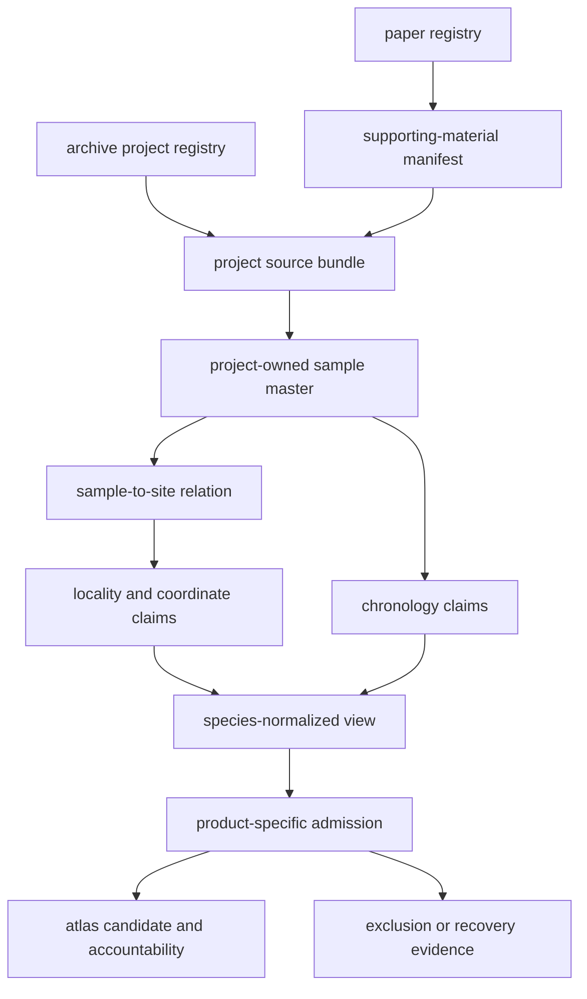
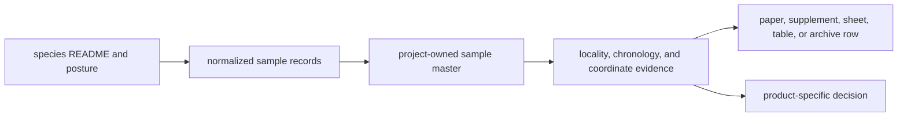

# Animal Ancient-DNA Evidence Database

`data/adna/` governs the animal ancient-DNA evidence program. Its durable unit
is the sample-backed evidence chain: project and paper identity, exact source
locator, stable sample identity, sample-to-site relation, locality claim,
chronology claim, coordinate posture, species view, and product admission.

Projects, papers, species summaries, atlas candidates, and map points are
related database objects. None replaces the project-owned sample evidence from
which it derives.

## Owned Partitions

| Partition | Authority | Boundary |
| --- | --- | --- |
| `governance/source_library/` | project and paper registries, captured source bundles, sample masters, sample-site relations, locality and chronology evidence | owns cross-project source accountability and project-level facts |
| `governance/` | cross-species product contract, ambiguity and caveat ledgers, coverage and readiness reviews | evaluates shared integrity without becoming the source of project facts |
| `species/<latin_name>/` | species-normalized records, manifests, review, and reporting views | groups project-owned evidence by taxon without minting new samples |
| `final/atlas/` | admitted atlas candidates and accountability | supplies a governed regional publication input, not final scientific truth |
| `final/countries/` | country publication linkage | records downstream scope relationships, not source locality authority |

## Evidence Graph

Every arrow is a governed relation. A paper may describe several projects; a
project may contain many samples; samples may share a site but not a date; one
sample may carry competing locality or chronology claims; one sample may be
admitted to one product and excluded from another.

## Fact Ownership

| Fact | Governing surface | Common derived consumer |
| --- | --- | --- |
| tracked project identity | `governance/source_library/project_registry.json` | project inventories and species summaries |
| tracked paper identity | `governance/source_library/paper_registry.json` | bibliography and supplement coverage |
| sample identity | `governance/source_library/projects/<project_accession>/sample_master.json` | species `sample_records.json` and atlas candidates |
| sample-to-site relation | project `sample_sites.json` | species site evidence and point admission |
| locality claim | project `sample_locality_evidence.json` | locality summaries, coordinate provenance, and geometry |
| chronology claim | project `sample_chronology_evidence.json` | temporal review, comparison, and popup fields |
| species-normalized view | `species/<latin_name>/normalized/sample_records.json` | taxon summaries and discovery surfaces |
| atlas admission | `final/atlas/animal_atlas_point_candidates.json` | world, regional, and country publication members |

When a derived value disagrees with its governing surface, correct the owner
and regenerate descendants. Editing an atlas candidate cannot resolve a
project sample, locality, or chronology defect.

## Database States

Animal evidence remains queryable when it is incomplete or unsuitable for one
publication:

| State | Meaning |
| --- | --- |
| recovered | a source row and locator entered a project-owned sample surface |
| identity resolved | native and repository identifiers refer to one governed sample |
| claim qualified | locality, chronology, or coordinate evidence is usable only with a declared limit |
| conflicted or unresolved | supported values disagree or available evidence cannot justify one value |
| admitted | the governed evidence satisfies one named product contract |
| excluded or deferred | a known sample fails the product or awaits recoverable evidence |

The checked-in program contains 868 recovered animal sample rows across 40
archive projects. That denominator establishes recovered rows, not complete
project recovery: only four projects currently have a trustworthy expected
sample count. Atlas publication remains a smaller, claim-specific population.

## Trace One Published Sample

1. Begin with the atlas or country member and product identity.
2. Resolve its accountability row to the species-normalized sample.
3. Resolve the species row to the project-owned stable sample identifier.
4. Inspect sample-to-site, locality, chronology, and coordinate evidence as
   independent claims.
5. Recover the project, paper, supplement, sheet, table, or row locator.
6. Apply conflicts, qualifications, exclusions, and recovery state before
   reusing the public claim.

A visible coordinate cannot substitute for this traversal. The same numeric
pair can be source-supplied, named-site resolved, approximate, substituted, or
unsupported; only the evidence chain establishes which meaning applies.

## Query One Species View

Species roots provide a compact entrance into evidence that remains owned by
projects, papers, samples, and claim records:

1. Read the species README for role, curation class, release posture, project
   deficits, and blocking reasons.
2. Select the observation unit before using a count: project, recovered
   sample, site, locality, coordinate row, or publication member.
3. Resolve the normalized record to the project-owned sample and its captured
   source locator.
4. Inspect locality, chronology, and coordinate claims independently.
5. Follow any public descendant to its admission record and product manifest.
6. Carry unresolved, pending, rejected, excluded, and out-of-scope records
   into the population account.

Human and non-human species roots have different material depth. The human
root exposes the governed AADR v66 capture but has no normalized or review
member artifacts in this checkout. The ten non-human roots materialize broader
generated evidence and review surfaces. Directory symmetry does not establish
lifecycle symmetry.

## Species View Regeneration

Non-human species READMEs and their companion evidence files are produced by
`bijux_pollenomics.adna.species.tracked_data`. The human README and AADR link
contract are produced by `bijux_pollenomics.data_downloader.data_layout`.
Change those owners before regenerating descendants.

After regeneration, verify that:

- every species README matches its renderer;
- sample, project, site, coordinate, and publication counts remain typed and
  are not presented as one funnel;
- release gates remain distinct from per-project recovery and product
  admission;
- missing human lifecycle members remain disclosed; and
- source identity, fact ownership, blockers, and product decisions still
  reconcile.

## Primary Entry Points

- [`governance/source_library/project_registry.json`](governance/source_library/project_registry.json)
- [`governance/source_library/paper_registry.json`](governance/source_library/paper_registry.json)
- [`governance/animal_sample_product_contract.json`](governance/animal_sample_product_contract.json)
- [`governance/path_ownership_map.md`](governance/path_ownership_map.md)
- [`species/equus_caballus/README.md`](species/equus_caballus/README.md)
- [`species/ovis_aries/README.md`](species/ovis_aries/README.md)
- [`final/atlas/animal_atlas_point_candidates.json`](final/atlas/animal_atlas_point_candidates.json)
- [`final/atlas/animal_atlas_candidate_accountability.md`](final/atlas/animal_atlas_candidate_accountability.md)
- [`final/countries/country_publication_index.json`](final/countries/country_publication_index.json)

The public [database model](../../docs/public/pollenomics-data/database/index.md),
[sample-record contract](../../docs/public/pollenomics-data/evidence/sample-records.md),
[species-view contract](../../docs/public/pollenomics-data/evidence/species-evidence-views.md),
and [record-admission contract](../../docs/public/pollenomics-data/curation/record-admission.md)
define how these surfaces may be interpreted and reused.
