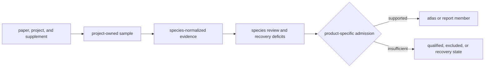

# Cattle Evidence View

`Bos taurus` is a species-owned projection over project, paper,
supplement, sample, locality, chronology, and coordinate evidence. This
directory makes the current curation posture inspectable; it is not an
independent source database and does not transfer fact ownership away from
the project evidence under `../../governance/source_library/`.

## Current Curation Snapshot

- Latin name: `Bos taurus`
- Product role: `domesticated_core`
- Dataset bucket: `archive_verified_needs_paper_pinning`
- Curation class: `paper_pinned_core`
- Curated sample rows: `13`
- Curated projects: `2`
- Curated site rows: `1`
- Direct-coordinate rows: `0`
- Geocoded rows: `0`
- Unresolved sample rows: `2`
- Mapped Nordic rows: `0`
- Tracked intake projects: `3`
- Projects with sample recovery gaps: `2`
- Projects with site-recovery gaps: `1`
- Projects with chronology gaps: `0`
- Projects blocked before publication review: `3`
- Pending projects: `1`
- Rejected projects: `0`

These values describe different observation units. Sample, project, site,
coordinate, and publication counts are not one attrition funnel and must not
be divided into a collection-wide completeness percentage.

## Interpret The Posture

| Signal | Meaning |
| --- | --- |
| product role `domesticated_core` | the intended contribution of this taxon to governed products |
| dataset bucket `archive_verified_needs_paper_pinning` | the present evidence grouping, not a biological category |
| curation class `paper_pinned_core` | the evidence rule used to classify project support |
| release gate `false` | whether the current species review satisfies its declared release conditions |
| supported-status eligibility `false` | whether current evidence permits the stronger supported posture |

The species release gate evaluates the declared role and review contract. It
does not assert that every tracked project is recovered or publication-ready;
project deficits and product admission remain separate decisions.

Paper-pinned core domestication support exists for this species. Curated projects are fit for governed comparative use, while pending projects still need stronger archive-paper linkage.

### Current Blocking Reasons

- `missing_primary_paper_pins`
- `missing_archive_paper_pinning_rationale`
- `ancient_but_not_domesticated_core_projects`
- `mixed_species_rule_unresolved`

A clear blocker is retained evidence, not a failed attempt at presentation.
It identifies the project, sample, locality, chronology, or source-recovery
boundary that must change before a stronger species or publication claim.

## Inspect The Evidence

| Question | Governing surface |
| --- | --- |
| Which source projects and artifacts are represented? | `raw/archive_inventory.json` and `raw/source_snapshot.json` |
| Which stable samples are recovered? | `normalized/sample_records.json` |
| How are samples related to sites? | `normalized/site_evidence.json` |
| What supports each mapped coordinate? | `normalized/coordinate_provenance.json` |
| Which locality units are available? | `normalized/locality_summaries.json` |
| Which curation and runtime revision produced the view? | `manifests/curation_manifest.json` and `manifests/runtime_manifest.json` |
| What remains incomplete by project? | `reports/project_recovery_deficits.md` |
| Why is the present posture accepted or blocked? | `review/species_review.md` |

Start from the claim being inspected, recover its stable sample and project
identity, then follow locality, chronology, coordinate, and admission evidence
independently. A repeated value in a species view remains subordinate to the
project-owned fact identified by its lineage.

## Directory Contract

| Directory | Responsibility |
| --- | --- |
| `raw/` | archive inventory and source wording snapshots |
| `normalized/` | sample, site, coordinate, project, and locality projections |
| `manifests/` | species, citation, curation, normalization, project, and runtime identities |
| `reports/` | support summaries and project recovery deficits |
| `review/` | release blockers, project rows, and archive-integrity evidence |

## Evidence Boundary

Species grouping does not prove project completeness, sample independence,
exact locality, comparable chronology, Nordic membership, or publication
fitness. Those claims require their own governing records and product rules.
Rows that remain unresolved, pending, rejected, or blocked stay visible so
the mapped subset cannot masquerade as the recovered collection.
