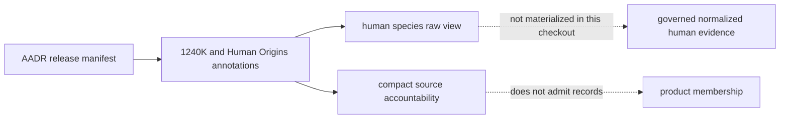

# Homo Sapiens Ancient-DNA Evidence View

`Homo sapiens` is the species-owned route into the checked-in AADR metadata
capture. The `raw/aadr` link preserves one source release under both its
source-family identity and its human-species identity without copying or
forking the captured files.

## Current Material State

| Surface | Present state | Supported conclusion |
| --- | --- | --- |
| `raw/aadr/v66/release_manifest.json` | present through the governed symlink | release identity, requested members, retrieval metadata, and checksums are inspectable |
| `raw/aadr/v66/1240k/v66.1240K.aadr.PUB.anno` | present | captured 1240K annotation rows can be inspected at release v66 |
| `raw/aadr/v66/ho/v66.HO.aadr.PUB.anno` | present | captured Human Origins annotation rows can be inspected at release v66 |
| `normalized/` | no governed member artifact | a current normalized human species database is not established here |
| `manifests/` | no governed member artifact | no species-view build or membership identity is established here |
| `review/aadr_v66_source_accountability.json` | present | panel reconciliation, source-row and Genetic-ID denominators, and exact source-reported political-entity dispositions are reproducible without storing a full derived stream |
| `reports/` | no governed member artifact | retained report products elsewhere cannot be inferred backward from this directory |

The present evidence supports source-capture inspection, metadata-level
analysis of the retained annotation members, and a compact source-accountability
review surface. It does not support a claim that the human species view has a
complete raw-to-normalized-to-admitted lifecycle in this checkout.

## Inspect The Capture

1. Open `raw/aadr/v66/release_manifest.json` and confirm the persistent dataset
   identity, requested release, member paths, hashes, and retrieval metadata.
2. Select the 1240K or Human Origins annotation member explicitly; do not
   treat the panels as interchangeable or add their row counts without a
   deduplication contract.
3. Preserve the source-native genetic identifier, panel identity, release,
   location fields, temporal fields, and publication lineage used by the
   query.
4. Follow any published descendant to its product manifest and geography
   decision rather than treating presence in an annotation file as automatic
   atlas or country membership.
5. Use the compact accountability receipt for panel and source-label
   denominators, while stating that normalized membership and product admission
   remain unavailable.

## Evidence Boundary

This surface is metadata-only. It does not contain genotype calls, sequence
reads, imputation, kinship analysis, population-genetic inference, or a
repository-owned genotype processing workflow. Geographic labels and
coordinates in AADR metadata describe the retained source record at its
declared resolution; they do not create archaeological-site precision.

A retained country or world report may remain inspectable at its named
version even while this species lifecycle is incomplete. That publication is
a governed product artifact, not proof that missing normalized or review
authorities exist. Rebuildability, source capture, and retained publication
are separate claims and must be reported separately.

## Required Evidence For A Stronger Posture

A complete human species lifecycle would still require a versioned normalized
member set, locality and chronology semantics, product admission records, and
traceability from every published member back to its AADR release member. The
accountability receipt closes source-row and panel-reconciliation questions;
it does not close those downstream scientific boundaries.
