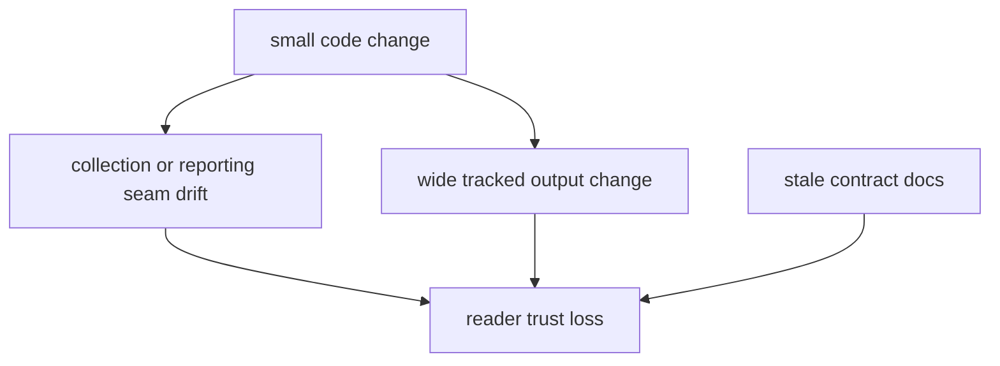

# Architecture Risks

The package architecture is intentionally simple, but its main risks are not
equal. The worst failures are the ones that damage trust in tracked outputs or
blur the line between collection, publication, and adjacent repository
surfaces.

## Risk Model

This page should show risk as a trust problem, not just a maintenance problem.
The dangerous failures are the ones that make visible repository surfaces stop
matching the runtime boundaries readers think they are inspecting.

## Current Risks

- tracked file outputs can make small code changes look large in review
- upstream source changes can pressure the package into source-specific special
  cases that leak across the runtime
- report rendering and data collection both touch durable files, so boundary
  drift between them is costly
- docs can lag behind package behavior if output contracts change without a
  matching handbook update

## Higher-Risk Failures

- output-path or slug renames that force wide downstream change
- source-specific special cases that leak across the runtime
- collection and reporting boundary drift around durable files
- docs lagging behind contract changes in visible publication surfaces

## First Proof Check

- `tests/regression/test_repository_contracts.py`
- `tests/regression/test_data_collector.py`
- `tests/regression/test_country_report.py`

## Design Pressure

The easy failure is to talk about architecture risk in code-only terms, while
the real damage usually appears later in review noise, boundary drift, and
publication surfaces that no longer feel trustworthy.
