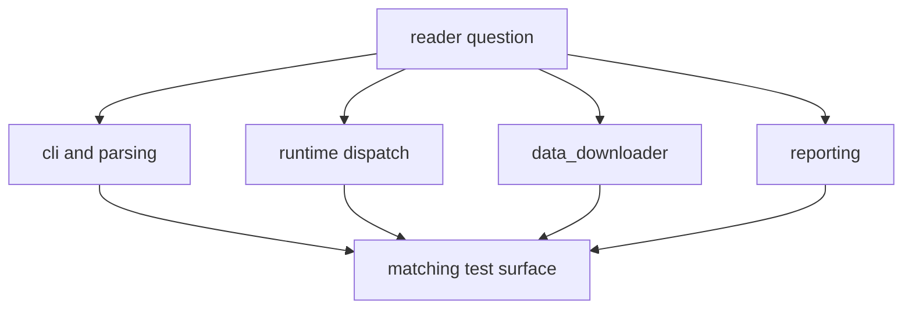

# Code Navigation

Open the shortest path that matches the question you already have.

## Navigation Model

This page should reduce navigation waste. The point is not to list directories;
it is to get a reader from one concrete question to the smallest code and test
surface that can answer it.

## Start Points By Question

- command syntax or default flags: start in `cli.py` and
  `command_line/parsing/`
- command dispatch behavior: read `command_line/runtime/dispatch.py` and
  `handlers.py`
- source collection behavior: read `data_downloader/api.py`, `collector.py`,
  and `pipeline/`
- source-specific quirks: move into `data_downloader/sources/<source>/`
- report publishing behavior: read `reporting/service.py`, `reporting/api.py`,
  and `reporting/bundles/`
- rendered output shape: inspect `reporting/rendering/` and
  `reporting/map_document/`

## Test Navigation

- unit behavior: `tests/unit/`
- output regression checks: `tests/regression/`
- CLI behavior: `tests/e2e/test_cli.py`

## First Proof Check

- `src/bijux_pollenomics/`
- `packages/bijux-pollenomics/tests/`

## Design Pressure

The common failure is to turn navigation into a codebase tour, which makes
readers scan everything instead of following the one path that matches their
actual question.
