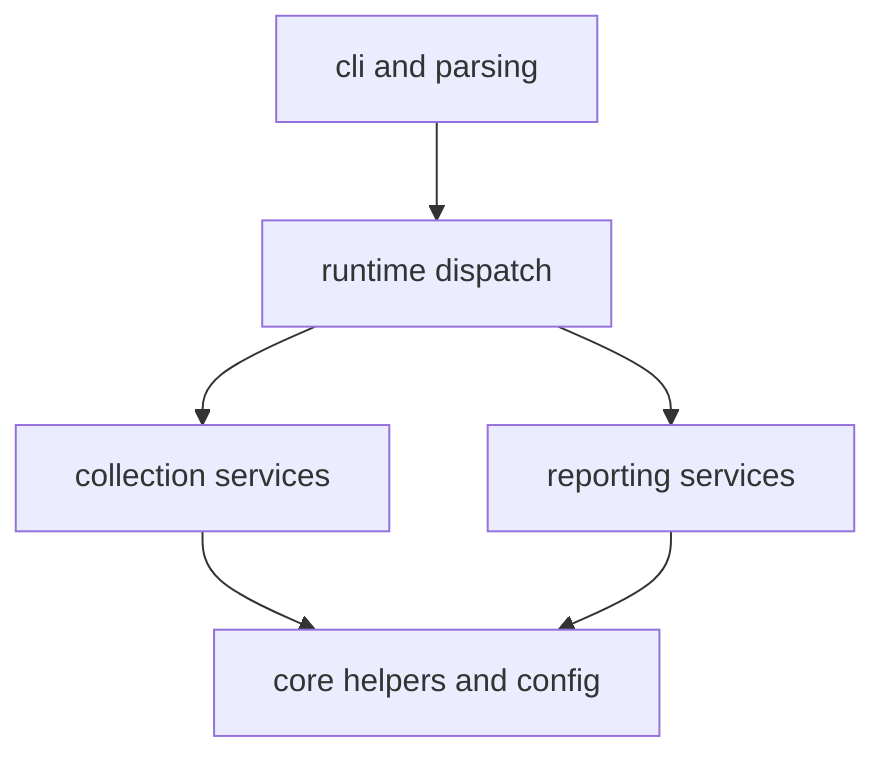

# Dependency Direction

Dependency direction should make ownership easier to see as the runtime grows,
not harder.

## Dependency Model

This page should make dependency direction legible as an ownership aid. The
real question is whether imports keep command entry, collection, and reporting
separate enough that reviewers can still see where a change belongs.

## Intended Direction

- CLI entrypoints depend on parsing and runtime dispatch
- dispatch depends on collector and reporting services
- collector and reporting code depend on `core/`, `config.py`, and their own
  local contracts
- low-level helpers do not depend back on command registration or docs
  concerns

## Dependency Regressions

- report-rendering modules should not start redefining raw collection behavior
- low-level helpers should not pull CLI parsing or docs policy back inward
- source-specific shortcuts should not become cross-package rules by import

## First Proof Check

- imports under `command_line/runtime/`
- imports under `data_downloader/pipeline/` and `data_downloader/sources/`
- imports under `reporting/`

## Design Pressure

The easy failure is to accept convenient reverse dependencies that save local
effort but quietly erase the boundaries the rest of the handbook is trying to
explain.
