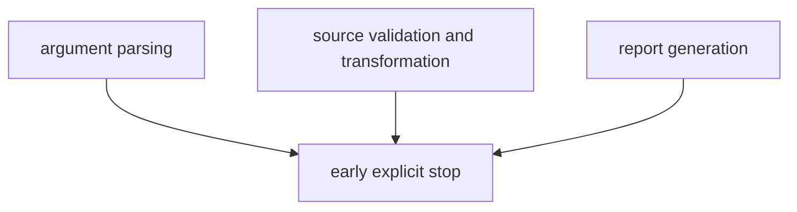

# Error Model

The package should fail early enough that readers can tell whether a problem is
command shape, source handling, or publication assembly.

## Error Model Diagram

This page should show failures by the stage that owns them. Readers need to
know whether a command died before writes started, during source handling, or
while assembling publication outputs.

## Failure Expectations

- invalid command shapes should fail during argument parsing
- unsupported source names should fail before any write path begins
- source fetch or transformation problems should stop the affected command
- report generation failures should not be hidden behind partially successful
  publication claims

## Failure Classes

- invalid command shape: fail during argument parsing
- unsupported source or bad transformation: fail before tracked writes become
  authoritative
- report-generation failure: fail before publication claims are left half true

## First Proof Check

- `tests/unit/test_command_line.py`
- `tests/unit/test_source_registry.py`
- `tests/unit/test_reporting_artifacts.py`
- `tests/regression/test_country_report.py`

## Design Pressure

The common failure is to collapse every failure into one generic runtime error,
which hides the exact boundary where the command stopped being trustworthy.
