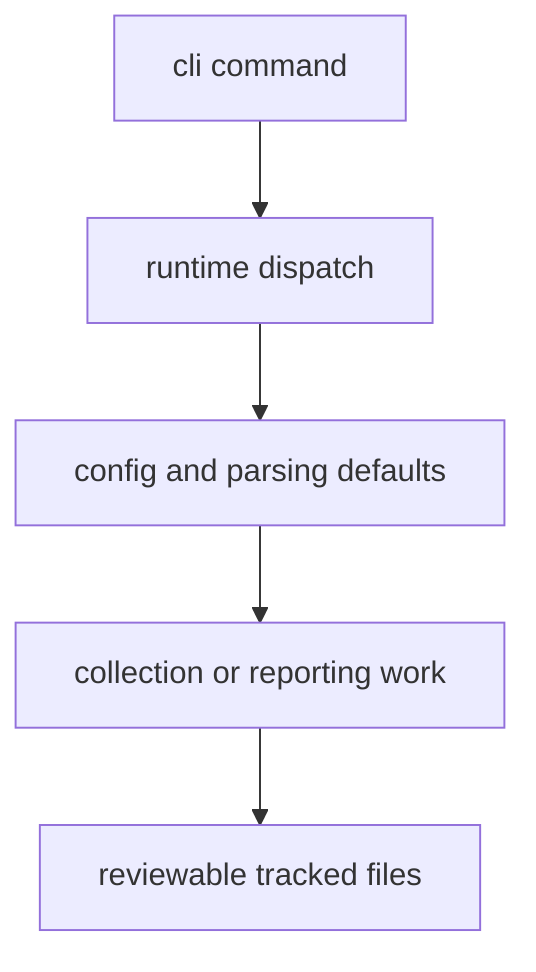

# Execution Model

The package executes as an explicit command-driven batch workflow. One command
becomes one bounded run that either rewrites tracked files clearly or fails
before leaving ambiguous state behind.

## Execution Model Diagram

This page should make the runtime feel like one bounded batch path. A command
is successful only when its filesystem work and its visible tracked outputs are
still easy to read in review after the process exits.

## Runtime Shape

1. the root CLI parses arguments into one named subcommand
2. runtime dispatch resolves the matching handler
3. the handler loads defaults from `config.py` and option parsing helpers
4. collection or reporting code performs deterministic filesystem work
5. the command exits after writing reviewable files

## First Proof Check

- `src/bijux_pollenomics/cli.py`
- `src/bijux_pollenomics/command_line/runtime/`
- `src/bijux_pollenomics/data_downloader/collector.py`
- `src/bijux_pollenomics/reporting/service.py`
- `tests/e2e/test_cli.py`

## Design Pressure

The easy failure is to describe execution as generic task running, which hides
that each command is really a controlled rewrite path through durable
repository surfaces.
