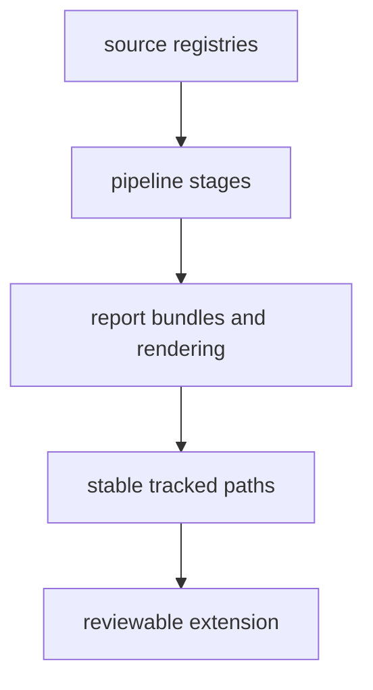

# Extensibility Model

The package should extend through named registries, pipeline stages, and stable
path contracts instead of through scattered special cases.

## Extension Model

This page should make extension work look constrained on purpose. The runtime
is extensible only when new source or report behavior still lands in named
hooks and stable tracked paths that reviewers can reason about.

## Expected Extension Paths

- add new source integrations through `data_downloader.sources` and source
  registry wiring
- add new staging or summary behavior through `data_downloader.pipeline`
- add new report artifacts through `reporting.bundles`, `reporting.rendering`,
  and related context helpers

## Guardrails

- new extensions should still land in deterministic tracked paths
- source-specific behavior should stay source-scoped rather than becoming a
  cross-package shortcut
- extension work should update docs and tests at the same time as code

## First Proof Check

- `data_downloader/pipeline/source_registry`
- `data_downloader/sources/`
- `reporting/bundles/` and `reporting/rendering/`
- `tests/unit/` and `tests/regression/`

## Design Pressure

The common failure is to add one-off logic where it first seems convenient,
which quickly turns extension work into hidden cross-cutting behavior.
