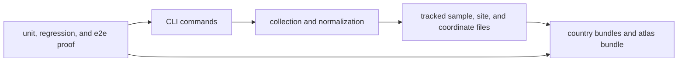

# Evidence Publication Flow

The runtime architecture matters only if it explains one chain clearly:
commands produce tracked evidence files, and those files produce atlas and
country outputs that can be reviewed outside the code.

## Flow

## Durable Boundaries

- `command_line/` owns CLI parsing and dispatch
- `data_downloader/` owns collection and tracked data layout
- `adna/` owns species, sample, site, and coordinate normalization
- `reporting/` owns country bundles, shared atlas, and published report roots

## What To Check First

- `packages/bijux-pollenomics/src/bijux_pollenomics/cli.py`
- `packages/bijux-pollenomics/src/bijux_pollenomics/adna/`
- `packages/bijux-pollenomics/src/bijux_pollenomics/reporting/`
- `packages/bijux-pollenomics/tests/`
