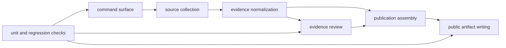

# Evidence Publication Flow

The runtime architecture matters only if it explains one chain clearly:
commands resolve one owned action, that action changes tracked evidence under
`data/`, and publication code turns that evidence into governed public
artifacts under `docs/report/`.

## Flow

## Durable Boundaries

- `command_line/` owns CLI parsing, dispatch, and command registration
- `data_downloader/` owns source-family collection, intake helpers, and tracked
  context normalization
- `adna/` owns animal aDNA intake, extraction, normalization, and validation
- `analysis/review/` owns ranking review packets rather than public rendering
- `reporting/` owns publication assembly, rendering, and governed report
  writing
- `foundation/` owns repository-truth, release posture, and architecture
  contracts

## What To Check First

- `packages/bijux-pollenomics/src/bijux_pollenomics/command_line/`
- `packages/bijux-pollenomics/src/bijux_pollenomics/data_downloader/`
- `packages/bijux-pollenomics/src/bijux_pollenomics/adna/`
- `packages/bijux-pollenomics/src/bijux_pollenomics/reporting/`

## Expanded Pages

- [runtime system model](runtime-system-model.md)
- [module map](module-map.md)
- [package split](package-split.md)
