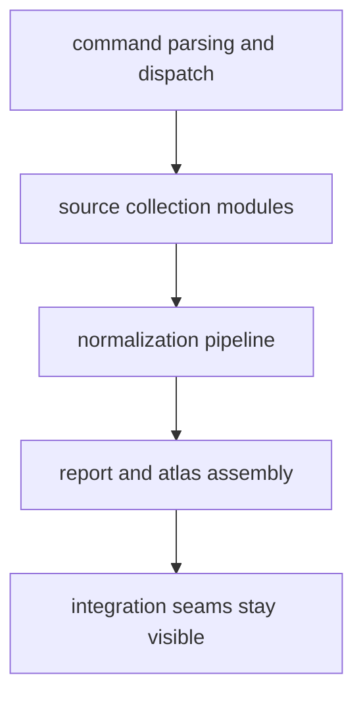

# Architecture

This section answers the structural question quickly: where runtime behavior
lives, how work moves through the package, and which seams must stay visible so
collection, normalization, and publication do not collapse into one vague
implementation blob.

## Architecture Model

This section should make the runtime shape visible before a reader opens code. If command flow, normalization, and publication still blur together here, the package structure is too implicit to defend in review.

## Start Here

- open [Module Map](https://bijux.io/bijux-pollenomics/01-bijux-pollenomics/architecture/module-map/) when the question starts from
  filenames and module families
- open [Execution Model](https://bijux.io/bijux-pollenomics/01-bijux-pollenomics/architecture/execution-model/) when the question is how a
  command becomes tracked outputs
- open [Integration Seams](https://bijux.io/bijux-pollenomics/01-bijux-pollenomics/architecture/integration-seams/) when the change may cross
  into data, atlas, or maintainer ownership

## Section Pages

- [Module Map](https://bijux.io/bijux-pollenomics/01-bijux-pollenomics/architecture/module-map/)
- [Dependency Direction](https://bijux.io/bijux-pollenomics/01-bijux-pollenomics/architecture/dependency-direction/)
- [Execution Model](https://bijux.io/bijux-pollenomics/01-bijux-pollenomics/architecture/execution-model/)
- [State and Persistence](https://bijux.io/bijux-pollenomics/01-bijux-pollenomics/architecture/state-and-persistence/)
- [Integration Seams](https://bijux.io/bijux-pollenomics/01-bijux-pollenomics/architecture/integration-seams/)
- [Error Model](https://bijux.io/bijux-pollenomics/01-bijux-pollenomics/architecture/error-model/)
- [Extensibility Model](https://bijux.io/bijux-pollenomics/01-bijux-pollenomics/architecture/extensibility-model/)
- [Code Navigation](https://bijux.io/bijux-pollenomics/01-bijux-pollenomics/architecture/code-navigation/)
- [Architecture Risks](https://bijux.io/bijux-pollenomics/01-bijux-pollenomics/architecture/architecture-risks/)

## What This Section Settles

- where command parsing ends and source-specific collection logic begins
- where data normalization hands off to publication assembly
- where tracked repository rewrites happen, and therefore where structural
  mistakes create visible review noise first

## First Proof Check

- `src/bijux_pollenomics/command_line/parsing/` and
  `src/bijux_pollenomics/command_line/runtime/` for CLI parsing and dispatch
- `src/bijux_pollenomics/data_downloader/pipeline/` and
  `src/bijux_pollenomics/data_downloader/sources/` for source-specific
  collection structure
- `src/bijux_pollenomics/reporting/bundles/` and
  `src/bijux_pollenomics/reporting/map_document/` for publication assembly
- `src/bijux_pollenomics/reporting/context/` for the map-layer integration
  surface that joins normalized records to visible atlas output

## Design Pressure

The common drift is to explain modules one by one while never making the collect-normalize-publish chain structurally legible as one bounded system.

## Boundary Test

If a structural explanation cannot identify the owning module family before a
reader opens code, the runtime shape is already too implicit.
