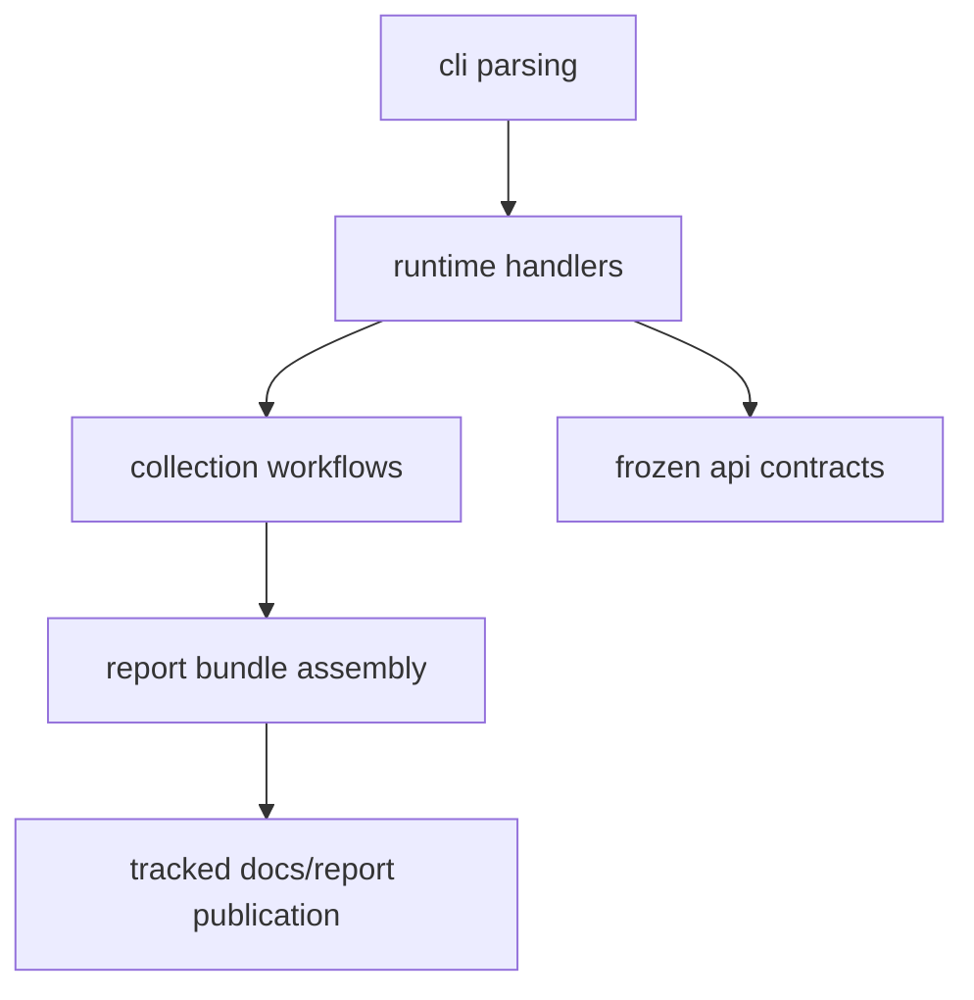

# Integration Seams

The package integrates across a small set of seams that have to stay explicit
enough to review.

## Seam Model

This page should help a reader see where assumptions are allowed to cross and
where they must stop. The seams matter because they keep collection, reporting,
docs publication, and frozen contracts reviewable as distinct surfaces.

## Main Seams

- CLI parsing to runtime handlers
- runtime handlers to `data_downloader` collection workflows
- normalized data outputs to `reporting` bundle assembly
- runtime outputs to tracked docs publication under `docs/report/`
- package code to frozen contracts under `apis/bijux-pollenomics/v1/`

## What Each Side May Assume

- CLI parsing may assume named commands and defaults, not source-specific file
  quirks
- collection may assume source contracts and tracked data layouts, not report
  rendering policy
- reporting may assume normalized inputs and bundle path contracts, not raw
  source fetch behavior
- docs publication may assume checked-in runtime outputs, not hidden runtime
  logic

## First Proof Check

- `command_line/runtime/`
- `data_downloader/contracts.py` and `data_downloader/data_layout.py`
- `reporting/bundles/paths.py` and `reporting/map_document/`
- `docs/report/`

## Design Pressure

The easy failure is to let seams disappear behind convenience imports, which
usually makes later output drift much harder to explain.
