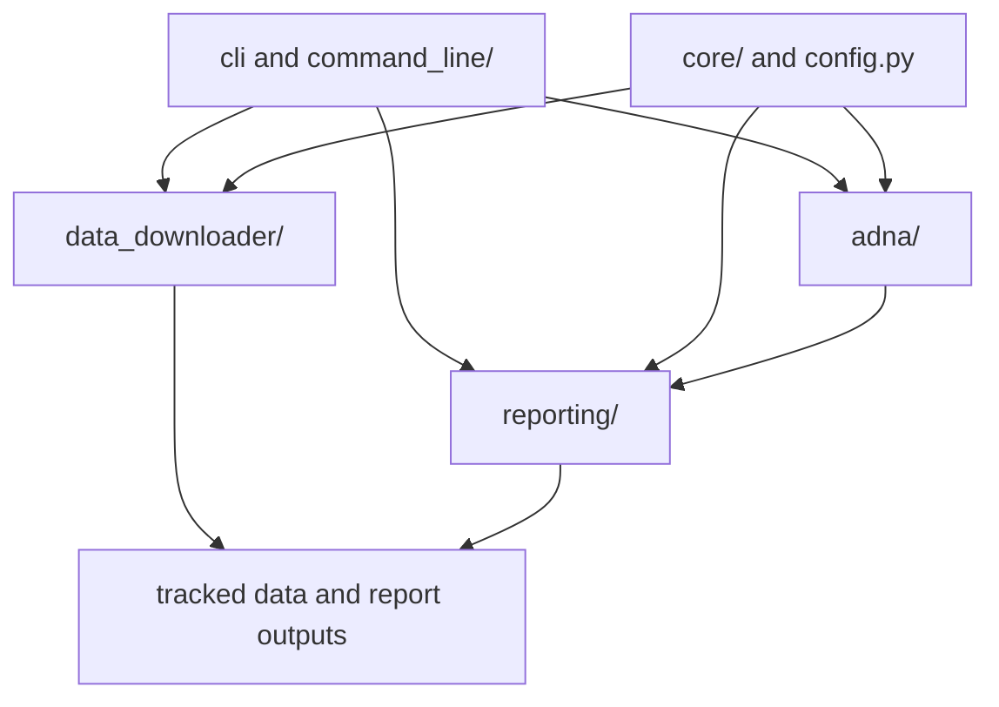

# Module Map

`bijux-pollenomics` is organized by workflow responsibility rather than by
framework layer. The structural question is simple: which module family owns
command entry, which owns tracked data shaping, and which owns published output
assembly.

## Module Model

This page should show module families by the work they own, not by directory
labels alone. Readers need to see which family shapes tracked data, which one
assembles publication, and where shared helpers stop.

## Owned Module Families

- `cli.py` and `__main__.py` provide the public command entrypoint
- `command_line/parsing/` defines parser structure and option wiring
- `command_line/runtime/` resolves handlers and command dispatch
- `core/` carries low-level helpers for files, time labels, text, HTTP, and
  GeoJSON handling
- `data_downloader/` owns source collection, staging, contracts, and spatial
  helpers
- `adna/` owns species-aware ancient-DNA contracts, typed sample records,
  Homo sapiens runtime manifests, metadata-only analysis boundaries,
  manifest-level support boundaries, curated ENA archive intake metadata,
  accession-family resolution, species admission rules, and archive-integrity
  checks
- `reporting/` owns AADR reporting, context layers, bundle assembly, and map
  rendering

## First Proof Check

- `src/bijux_pollenomics/command_line/parsing/` and
  `src/bijux_pollenomics/command_line/runtime/`
- `src/bijux_pollenomics/data_downloader/pipeline/`,
  `data_downloader/sources/`, and `data_downloader/spatial/`
- `src/bijux_pollenomics/adna/`
- `src/bijux_pollenomics/reporting/bundles/`,
  `reporting/rendering/`, `reporting/context/`, and
  `reporting/map_document/`
- `tests/unit/`, `tests/regression/`, and `tests/e2e/`

## Design Pressure

The common failure is to read the package as one big utility tree, which hides
the distinct responsibilities the handbook keeps trying to separate.
