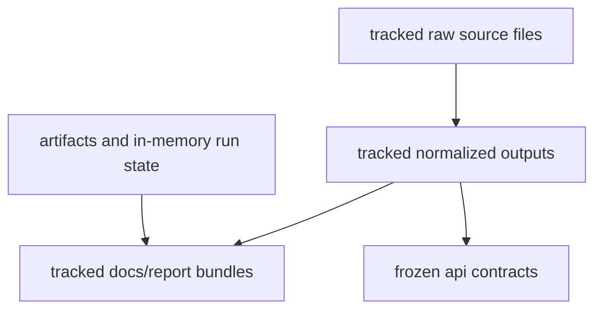

# State and Persistence

Persistent state in `bijux-pollenomics` is primarily file state. That matters
because review depends on knowing which writes are durable, which files are
authoritative, and which run products are disposable.

## Persistence Model

This page should make durable versus disposable state obvious. The repository’s
real runtime contract is mostly about which file surfaces remain authoritative
after the process exits.

## Durable State

- tracked source files under `data/<source>/raw/`
- normalized outputs under `data/<source>/normalized/`
- published report bundles under `docs/report/`
- frozen API contracts under `apis/bijux-pollenomics/v1/`

## Non-Durable State

- virtual environments and build artifacts under `artifacts/`
- command-local in-memory objects used during collection and reporting

## First Proof Check

- `data/`
- `docs/report/`
- `apis/bijux-pollenomics/v1/`
- `tests/regression/test_repository_contracts.py`

## Design Pressure

The easy failure is to treat every file a command touches as equally important,
which makes it harder to protect the small set of durable surfaces that readers
actually trust.
