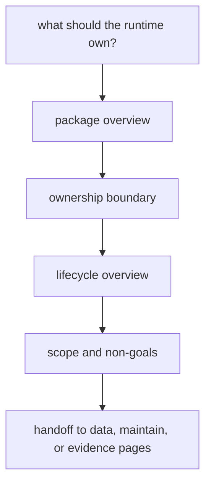

# Foundation

This section defines why the runtime package exists at all. It keeps one
foundational mistake visible: treating collection, provenance, publication, and
scientific interpretation as if they all belong to the same owner.

## Foundation Model

This section should move a reader from broad runtime claims to the exact point where package ownership stops. If the foundation pages cannot do that, every later architectural or operational explanation inherits blurred responsibility.

## Start Here

- open [Package Overview](https://bijux.io/bijux-pollenomics/01-bijux-pollenomics/foundation/package-overview/) for the shortest durable
  statement of the runtime's job
- open [Ownership Boundary](https://bijux.io/bijux-pollenomics/01-bijux-pollenomics/foundation/ownership-boundary/) when a proposed change may
  belong in the data handbook, maintainer handbook, or checked-in docs instead
- open [Lifecycle Overview](https://bijux.io/bijux-pollenomics/01-bijux-pollenomics/foundation/lifecycle-overview/) when you need the
  collect-normalize-publish loop before reading any module detail
- open [Scope and Non-Goals](https://bijux.io/bijux-pollenomics/01-bijux-pollenomics/foundation/scope-and-non-goals/) before expanding the
  runtime into a new data, workflow, or interpretation surface

## Section Pages

- [Package Overview](https://bijux.io/bijux-pollenomics/01-bijux-pollenomics/foundation/package-overview/)
- [Scope and Non-Goals](https://bijux.io/bijux-pollenomics/01-bijux-pollenomics/foundation/scope-and-non-goals/)
- [Ownership Boundary](https://bijux.io/bijux-pollenomics/01-bijux-pollenomics/foundation/ownership-boundary/)
- [Repository Fit](https://bijux.io/bijux-pollenomics/01-bijux-pollenomics/foundation/repository-fit/)
- [Capability Map](https://bijux.io/bijux-pollenomics/01-bijux-pollenomics/foundation/capability-map/)
- [Domain Language](https://bijux.io/bijux-pollenomics/01-bijux-pollenomics/foundation/domain-language/)
- [Lifecycle Overview](https://bijux.io/bijux-pollenomics/01-bijux-pollenomics/foundation/lifecycle-overview/)
- [Dependencies and Adjacencies](https://bijux.io/bijux-pollenomics/01-bijux-pollenomics/foundation/dependencies-and-adjacencies/)
- [Change Principles](https://bijux.io/bijux-pollenomics/01-bijux-pollenomics/foundation/change-principles/)
- [Surface Map](https://bijux.io/bijux-pollenomics/01-bijux-pollenomics/foundation/surface-map/)
- [Ownership Map](https://bijux.io/bijux-pollenomics/01-bijux-pollenomics/foundation/ownership-map/)

## What This Section Settles

- why the runtime owns the controlled transition from source material to
  checked-in outputs
- why provenance detail belongs in the data handbook instead of being folded
  into runtime ownership claims
- why publication behavior and scientific meaning must stay separable even when
  they touch the same visible atlas layer

## First Proof Check

- `src/bijux_pollenomics/cli.py` and `src/bijux_pollenomics/command_line/`
  for the operator-facing runtime boundary
- `src/bijux_pollenomics/data_downloader/collector.py` and
  `src/bijux_pollenomics/data_downloader/pipeline/` for the collection and
  normalization loop
- `src/bijux_pollenomics/reporting/` and
  `src/bijux_pollenomics/reporting/bundles/` for publication ownership
- `tests/regression/test_repository_contracts.py` for the repository-facing
  proof that package ownership still matches tracked outputs

## Design Pressure

The easy failure is to let runtime ownership sound comprehensive enough that provenance policy, maintainer enforcement, and atlas interpretation start slipping inward by habit.

## Boundary Test

If a proposal cannot explain why the runtime should own it instead of the data
handbook, maintainer handbook, fieldwork pages, or atlas publication surface,
this section should block the expansion.
