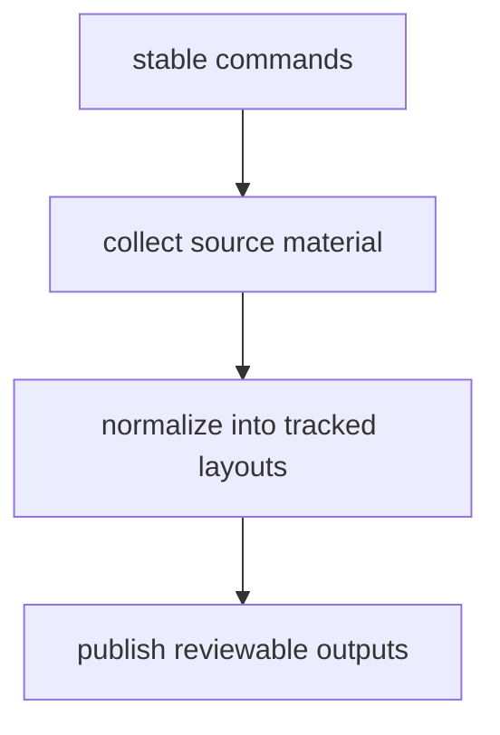

# Package Overview

`bijux-pollenomics` exists so the repository can rebuild its checked-in
evidence surfaces from stable commands instead of from hand-edited `data/` and
`docs/report/` trees. The package owns one loop: collect source material,
normalize it into tracked layouts, and publish reviewable outputs from those
files.

## Package Model

This page should give the shortest honest description of the runtime package: one controlled collect-normalize-publish loop with checked-in consequences. If that loop is not visible here, the package role becomes too vague everywhere else.

## What It Owns

- the CLI and command dispatch for `collect-data`, `report-country`,
  `report-multi-country-map`, and `publish-reports`
- source-specific collection and normalization for AADR, boundaries, LandClim,
  Neotoma, SEAD, and RAÄ inputs
- the tracked layout contracts written under `data/`
- report and atlas bundle assembly under `docs/report/`

## What It Refuses

- long-term repository maintenance policy, CI orchestration, and shared
  maintainer automation
- scientific interpretation beyond what the checked-in artifacts explicitly
  present
- hosted serving infrastructure outside the generated documentation site

## First Proof Check

- `packages/bijux-pollenomics/src/bijux_pollenomics/`
- `packages/bijux-pollenomics/tests/`
- `data/`
- `docs/report/`

## Design Pressure

The easy failure is to describe the package by file locations alone and lose the operational loop that actually justifies its existence.

## Boundary Test

If a new feature cannot be described as part of the collect-normalize-publish
loop, it probably belongs in the data handbook, the maintainer handbook, or a
public evidence page instead.
