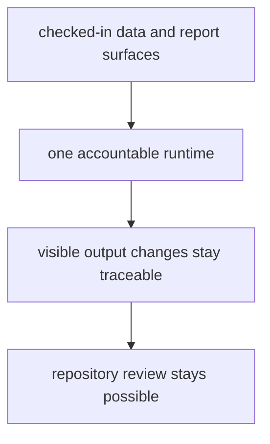

# Repository Fit

This package fits the repository because the repository publishes checked-in
evidence outputs and needs one accountable runtime that can regenerate them.
Without that runtime, collection rules, normalization rules, and publication
logic would drift into ad hoc scripts and hand-edited trees.

## Fit Model

This page should justify the package seam in repository terms, not only in software terms. The runtime earns its place only while it keeps visible evidence changes easier to trace than the ad hoc alternative.

## Why The Split Exists

- command entrypoints stay explicit instead of living in shell-only flow
- collection and reporting behavior can be tested as package behavior
- visible atlas and report changes can be traced back to one owning runtime

## First Proof Check

- `packages/bijux-pollenomics/src/bijux_pollenomics/`
- `packages/bijux-pollenomics/tests/`
- `data/`
- `docs/report/`

## Design Pressure

The common drift is to keep the package because it exists, rather than because it still makes checked-in evidence changes more reviewable than scattered scripts would.

## Boundary Test

If the package cannot make visible output changes easier to trace and review,
the split is no longer earning its place in the repository.
