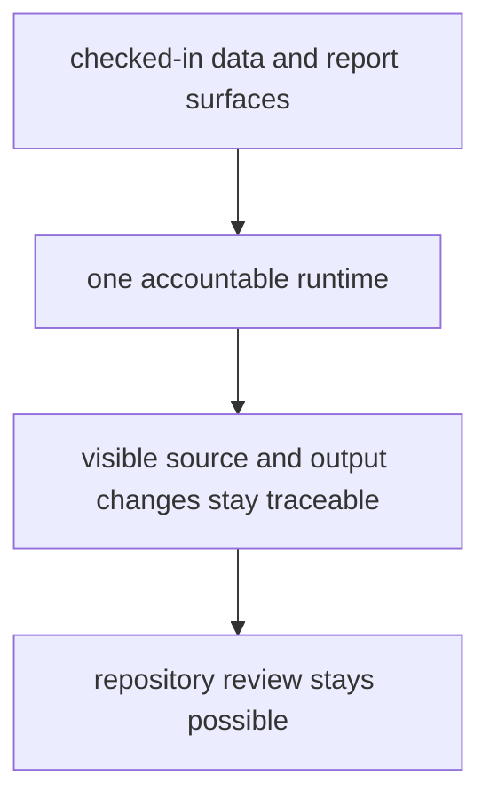

# Repository Fit

This runtime fits the repository because the repository publishes checked-in
evidence outputs and needs one accountable owner that can regenerate them
without narrowing the repository story to one data slice.

## Fit Model

The runtime earns its place only while it keeps pollen context, environmental
context, archaeology context, and aDNA context more reviewable than an ad hoc
script pile would.

## Why The Split Exists

- command entrypoints stay explicit instead of living in shell-only flow
- collection and reporting behavior can be tested as package behavior
- visible atlas and report changes can be traced back to one owning runtime
- cross-domain evidence families can share contracts without silently collapsing
  into one map-only story

## First Proof Check

- `packages/bijux-pollenomics/src/bijux_pollenomics/`
- `packages/bijux-pollenomics/tests/`
- `data/`
- `docs/report/`

## Boundary Test

If the runtime stops making visible evidence changes easier to trace and review,
the split is no longer earning its place in the repository.
