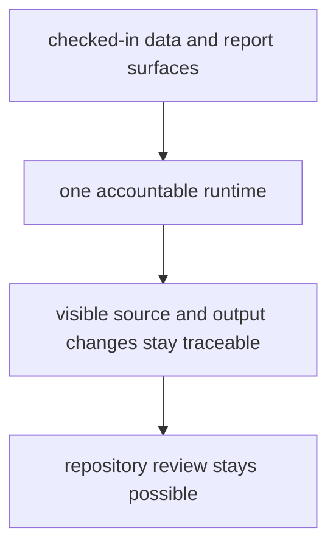

# Repository Scope and Limits

This repository is broader than one map layer and narrower than a finished
cross-evidence pollenomics platform.

It exists to publish reviewable evidence outputs that combine pollen context,
environmental archaeology, boundaries, fieldwork material, and animal ancient
DNA without pretending that those inputs are already equally mature.

The runtime belongs here because readers need one accountable rebuild path for
those outputs. The runtime does not earn its place by being complex; it earns
its place by making visible evidence changes easier to trace and review.

## Scope Model

The runtime earns its place only while it keeps pollen context, environmental
context, archaeology context, and aDNA context more reviewable than an ad hoc
script pile would.

## Why The Split Exists

- command entrypoints stay explicit instead of living in ad hoc shell history
- collection, normalization, and publication can be verified as one product
  surface
- visible atlas and report changes can be traced back to one owned rebuild path
- cross-domain evidence families can stay connected without collapsing into a
  single map-only story

## First Places To Check

- `packages/bijux-pollenomics/src/bijux_pollenomics/`
- `packages/bijux-pollenomics/tests/`
- `data/`
- `docs/report/`

## Boundary Test

If the runtime stops making visible evidence changes easier to trace and review,
the package split is no longer earning its place in the repository.
