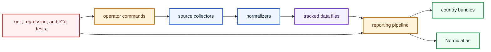

# bijux-pollenomics Runtime Handbook

`bijux-pollenomics` is the runtime package that rebuilds the repository's
checked-in evidence surfaces. It owns the command loop that collects source
material, normalizes it into tracked files, and publishes country bundles plus
the shared Nordic atlas.

<strong>Think in one runtime loop.</strong> The package collects and normalizes tracked evidence, turns that material into checked-in report bundles, and keeps the CLI and file contracts stable enough to review from the repository alone.

  <a class="md-button md-button--primary" href="https://bijux.io/bijux-pollenomics/01-bijux-pollenomics/interfaces/entrypoints-and-examples/">Open command entrypoints</a>
  <a class="md-button" href="https://bijux.io/bijux-pollenomics/01-bijux-pollenomics/operations/common-workflows/">Open common workflows</a>
  <a class="md-button" href="https://bijux.io/bijux-pollenomics/01-bijux-pollenomics/quality/test-strategy/">Open test strategy</a>

## Runtime Loop

The package matters because it makes the publication loop repeatable. It does
not just expose commands; it protects the chain from operator intent, through
source collection and normalization, into the files that the public reports and
atlas render. Runtime documentation should therefore explain how a reader can
rebuild the visible evidence surface, not only where the implementation files
live.

## Start Here

- open [Foundation](https://bijux.io/bijux-pollenomics/01-bijux-pollenomics/foundation/) when the question is why this
  package exists and where its ownership stops
- open [Interfaces](https://bijux.io/bijux-pollenomics/01-bijux-pollenomics/interfaces/) when the question is a command,
  default, file layout, or publication contract
- open [Operations](https://bijux.io/bijux-pollenomics/01-bijux-pollenomics/operations/) when the question is how to
  rebuild, release, diagnose, or recover the runtime loop
- open [Quality](https://bijux.io/bijux-pollenomics/01-bijux-pollenomics/quality/) when the question is what proof or risk
  bar blocks a change

## Pages In This Package

- [Foundation](https://bijux.io/bijux-pollenomics/01-bijux-pollenomics/foundation/)
- [Architecture](https://bijux.io/bijux-pollenomics/01-bijux-pollenomics/architecture/)
- [Interfaces](https://bijux.io/bijux-pollenomics/01-bijux-pollenomics/interfaces/)
- [Operations](https://bijux.io/bijux-pollenomics/01-bijux-pollenomics/operations/)
- [Quality](https://bijux.io/bijux-pollenomics/01-bijux-pollenomics/quality/)

## What This Package Owns

- the operator-facing commands that collect tracked evidence and rebuild
  publication outputs
- the code paths that normalize source material into repository-owned artifacts
- the report and atlas publication logic that turns tracked files into review
  surfaces

## What This Package Refuses

- the repository-wide documentation, release, and workflow rules explained in
  the maintainer handbook
- the source-specific provenance caveats explained in the data reference
- the scientific interpretation of the mapped evidence beyond what the checked-in
  artifacts and documented limitations support

## First Proof Check

- `packages/bijux-pollenomics/src/bijux_pollenomics/cli.py` and
  `packages/bijux-pollenomics/src/bijux_pollenomics/command_line/` for the
  command entry surface
- `packages/bijux-pollenomics/src/bijux_pollenomics/data_downloader/` for
  collection, normalization, and tracked data layout behavior
- `packages/bijux-pollenomics/src/bijux_pollenomics/reporting/` for country
  bundles, atlas output, and publication logic
- `packages/bijux-pollenomics/tests/` for unit, regression, and end-to-end
  proof that the runtime loop still holds

## Boundary Test

If a proposed change makes the package broader without making the
collect-normalize-publish loop clearer, the change probably belongs in the
data handbook, the maintainer handbook, or the field evidence surfaces instead.
