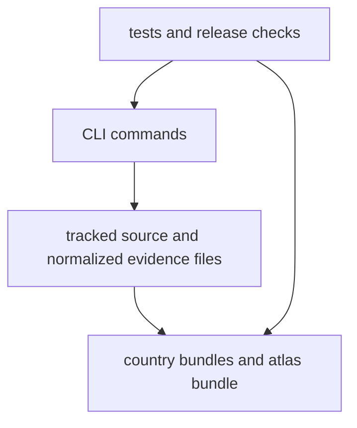

# bijux-pollenomics Runtime Handbook

`bijux-pollenomics` is the runtime package that rebuilds the repository's
checked-in evidence surfaces across pollen context, environmental archaeology,
boundary framing, fieldwork material, and ancient DNA context. It does one
durable job: collect tracked source families, normalize them into reviewable
files, and publish country bundles plus the shared Nordic atlas as downstream
views.

  <a class="md-button md-button--primary" href="interfaces/cli-surface/">Open the CLI surface</a>
  <a class="md-button" href="interfaces/entrypoints-and-examples/">Open command entrypoints</a>
  <a class="md-button" href="interfaces/artifact-contracts/">Open the artifact contracts</a>
  <a class="md-button" href="operations/common-workflows/">Open common workflows</a>
  <a class="md-button" href="operations/installation-and-setup/">Open the install and rebuild path</a>
  <a class="md-button" href="quality/test-strategy/">Open test strategy</a>

## Runtime Loop

The runtime handbook is for readers who need to understand how a visible
publication surface is rebuilt. It is not an internal catalog of helpers.

## Start Here

- why this package exists and where it stops:
  [foundation](foundation/index.md)
- how commands, tracked files, and outputs connect:
  [architecture](architecture/index.md)
- which commands and files are part of the public contract:
  [interfaces](interfaces/index.md)
- how to install, rebuild, and verify:
  [operations](operations/index.md)
- how proof is layered and where current limits still sit:
  [quality](quality/index.md)

## Breadth Restored

- [runtime system model](architecture/runtime-system-model.md): execution path,
  dependency direction, persistence, and failure boundaries
- [runtime scope and ownership](foundation/runtime-scope-and-ownership.md):
  capability map, ownership boundary, lifecycle, and change principles
- [entrypoints and examples](interfaces/entrypoints-and-examples.md): installed
  command paths for verification, data refresh, and report publication
- [common workflows](operations/common-workflows.md): fresh checkout, data
  refresh, publication review, and full local rebuild
- [change validation](quality/change-validation.md): proof layers and the docs
  breadth rule

## What This Package Owns

- the operator-facing commands that collect tracked evidence and rebuild
  publication outputs
- the code paths that normalize pollen, archaeology, boundary, and aDNA source
  material into repository-owned artifacts
- the report and atlas publication logic that turns tracked files into review
  surfaces
- the candidate ranking logic that summarizes locality proximity against the
  checked-in atlas context layers

## What This Package Does Not Claim

- the repository-wide documentation, release, and workflow rules explained in
  the maintainer handbook
- the source-specific provenance caveats explained in the data reference
- the scientific interpretation of the mapped evidence beyond what the checked-in
  artifacts and documented limitations support
- claims that the current animal aDNA recovery state already equals full
  pollenomics analysis
