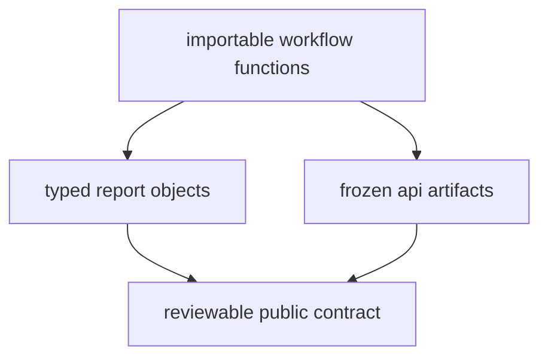

# API Surface

This package does not present a standalone long-lived HTTP service. Its public
API surface is a narrow set of importable workflow functions plus frozen API
contract artifacts under `apis/bijux-pollenomics/v1/`.

## API Surface Model

This page should make the API surface feel narrow and explicit. The important
public promise is not a service endpoint; it is the combination of importable
workflow entrypoints and checked-in contract artifacts that stay reviewable in
the repository.

## Importable Entry Points

- `collect_data` and `collect_context_data` from `data_downloader.api`
- `generate_country_report`, `generate_multi_country_map`, and
  `generate_published_reports` from `reporting.api`

## Report Types

- `DataCollectionReport`
- `ContextDataReport`
- `CountryReport`
- `MultiCountryMapReport`
- `PublishedReportsReport`

## Frozen Contract Artifacts

Repository-level API expectations are pinned under `apis/bijux-pollenomics/v1/`
with `schema.yaml`, `pinned_openapi.json`, and `schema.hash`.

## First Proof Check

- `src/bijux_pollenomics/data_downloader/api.py`
- `src/bijux_pollenomics/reporting/api.py`
- `apis/bijux-pollenomics/v1/`
- `packages/bijux-pollenomics-dev/src/bijux_pollenomics_dev/api/openapi_drift.py`

## Design Pressure

The common failure is to describe the runtime API as if it were a broad
application surface, when the real contract is intentionally small and tied to
workflow functions plus frozen checked-in artifacts.
