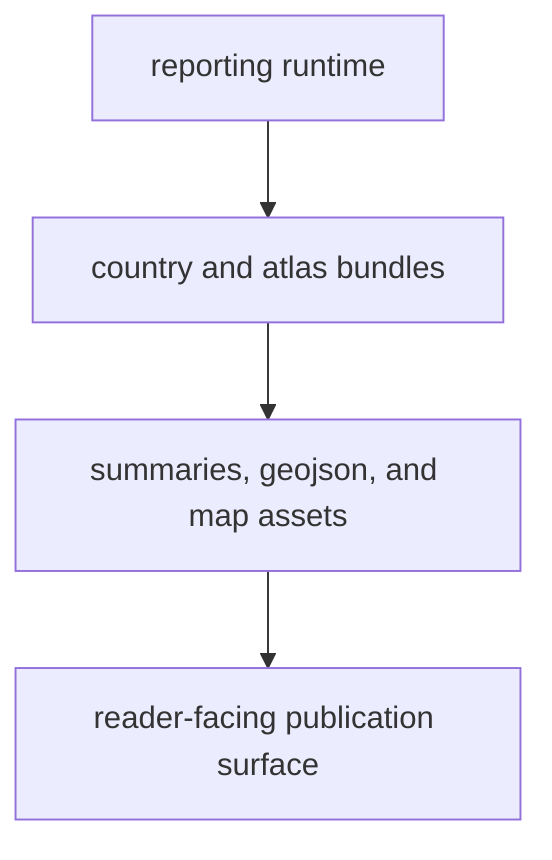

# Artifact Contracts

Published artifacts are part of the package contract because they are checked
in and reviewed like code. Readers encounter them as the country bundles and
the atlas itself, not as disposable build leftovers.

## Artifact Contract Model

This page should make artifact contracts feel like reviewed publication
surfaces. The key point is that broken bundle shape or missing assets are
contract failures, not cosmetic output glitches.

## Main Artifact Families

- country bundles under `docs/report/<country-slug>/`
- the shared atlas under `docs/report/nordic-atlas/`
- root-level report artifacts under `docs/report/` that summarize public animal
  coverage, chronology overlap, first appearance, and scenario posture
- report summaries and map payloads produced by the reporting package
- atlas candidate ranking sidecars that summarize locality proximity against
  tracked context layers

## Stable Path Anchors

- `reporting/bundles/paths.py` defines the named path families for country and
  atlas bundles
- country bundles include `README.md`, sample and locality CSV files, sample
  GeoJSON, sample Markdown, and summary JSON outputs
- country bundles can also include country-resolved animal aDNA summary JSON,
  species CSV, locality GeoJSON, citation Markdown, and warning Markdown when
  tracked animal locality leads are assignable into the country surface
- atlas bundles include `README.md`, the map HTML document, sample GeoJSON, and
  summary JSON outputs
- root-level report artifacts include `animal_output_audit.*`,
  `animal_country_species_coverage.*`, `animal_human_chronology_overlap.*`,
  `animal_pollen_chronology_overlap.*`,
  `animal_first_appearance_by_country.*`, and
  `nordic_farming_history_scenario.*`
- atlas candidate ranking sidecars include one CSV file for machine-readable
  sorting and one Markdown file for reader review
- bundled map assets copied by the rendering layer are part of the publication
  surface because broken assets break the published reader experience

## First Proof Check

- `docs/report/`
- `src/bijux_pollenomics/reporting/bundles/paths.py`
- `src/bijux_pollenomics/reporting/rendering/`
- `tests/unit/test_reporting_artifacts.py`
- `tests/regression/test_country_report.py`

## Design Pressure

The easy failure is to treat published artifacts like disposable build output,
which makes path, file-shape, and asset regressions harder to catch before they
land in the reader experience.

The next easy failure is to let heuristic ranking files appear without stating
what they are. If candidate sidecars exist, their bundle shape and limit must
be treated as contract, not as hidden implementation detail.
