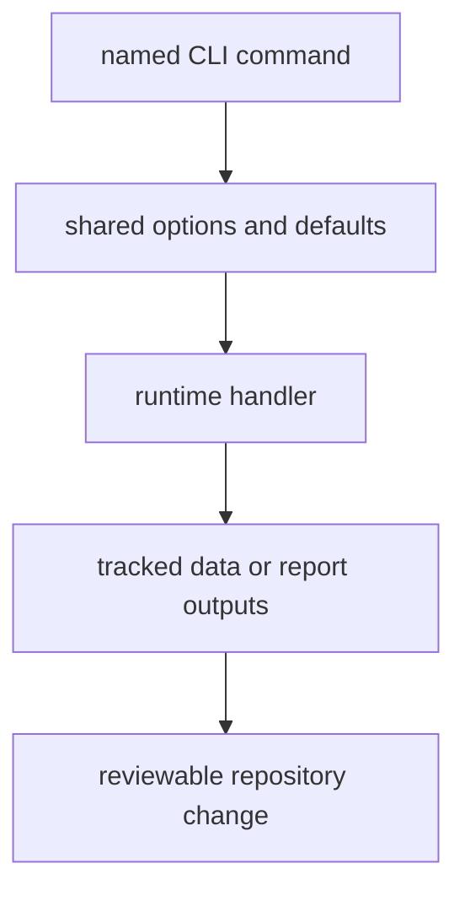

# CLI Surface

The CLI is the primary public interface for `bijux-pollenomics`. It matters
because these commands rewrite tracked repository state.

## CLI Model



This page should make the command surface feel bounded and reviewable. The user
is not just invoking helpers; they are choosing one explicit rewrite path
through the repository with visible output consequences.

## Supported Commands

- `collect-data <sources...>` collects tracked datasets into `data/`
- `report-country <country>` publishes one country bundle from AADR metadata
- `report-multi-country-map <countries...>` builds the shared atlas for a
  chosen country set
- `publish-reports` regenerates the checked-in publication bundle set using the
  repository defaults
- `surface-map` prints a short runtime-versus-roadmap package surface map
- `product-scope` prints explicit current atlas-builder scope versus not-yet-supported engine claims

## Shared Options

- `--version` selects the AADR version directory and defaults to `v66`
- `--aadr-root` defaults to `data/aadr`
- `--output-root` defaults to `data` for collection or `docs/report` for
  report publishing
- `--context-root` defaults to `data`
- `--name` and `--title` control the atlas slug and display title

## Example

```bash
bijux-pollenomics collect-data all --version v66 --output-root data
bijux-pollenomics publish-reports --aadr-root data/aadr --version v66 --output-root docs/report --context-root data
```

## First Proof Check

- `src/bijux_pollenomics/cli.py`
- `src/bijux_pollenomics/command_line/parsing/`
- `tests/e2e/test_cli.py`

## Design Pressure

The common failure is to document commands like generic utilities, which hides
that each CLI entrypoint is a controlled path for rewriting tracked evidence or
publication surfaces.
