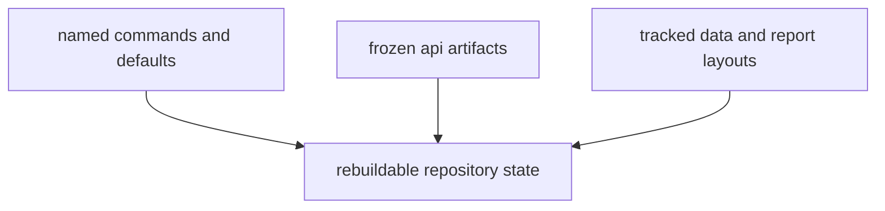

# Compatibility Commitments

Compatibility in `bijux-pollenomics` is about preserving rebuildability and
review clarity, not only preserving Python import names.

## Compatibility Model

This page should make compatibility look repository-wide. The real promise is
that commands, contracts, and tracked layouts stay stable enough that a reader
or operator can rebuild and review the same surfaces coherently over time.

## Current Commitments

- documented CLI commands remain named and scoped consistently
- default output roots and stable slugs change only deliberately
- frozen API contracts under `apis/bijux-pollenomics/v1/` stay synchronized with
  implementation
- tracked data and report layout changes are documented when they are
  intentional

## Known Non-Commitments

- upstream source services are not guaranteed stable by this package
- unpublished internal module names may change during refactors

## First Proof Check

- `tests/e2e/test_cli.py`
- `tests/unit/test_config.py`
- `tests/regression/test_repository_contracts.py`
- `apis/bijux-pollenomics/v1/`

## Design Pressure

The common failure is to narrow compatibility down to Python imports, which
hides the more consequential contract around rebuildability and reviewable
tracked outputs.
