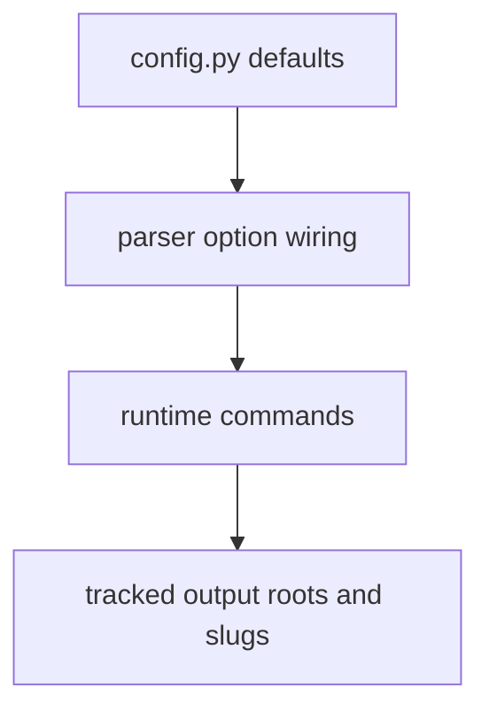

# Configuration Surface

Configuration is centered on explicit defaults rather than on hidden discovery.
That makes default changes public interface changes, not quiet implementation
detail.

## Configuration Model

This page should make defaults feel like visible interface decisions. A change
to version roots, slugs, titles, or output paths is not internal cleanup; it
widens directly into operator behavior and tracked output shape.

## Primary Defaults

- `DEFAULT_AADR_VERSION = "v66"`
- `DEFAULT_ATLAS_SLUG = "nordic-atlas"`
- `DEFAULT_ATLAS_TITLE = "Nordic Evidence Atlas"`
- `DEFAULT_PUBLISHED_COUNTRIES = ("Sweden", "Norway", "Finland", "Denmark")`
- default roots for `data/`, `data/aadr/`, and `docs/report/`

## Location

These defaults live in `packages/bijux-pollenomics/src/bijux_pollenomics/config.py`
and are reused by parser helpers under `command_line/parsing/options.py`.

## First Proof Check

- `packages/bijux-pollenomics/src/bijux_pollenomics/config.py`
- `src/bijux_pollenomics/command_line/parsing/options.py`
- `tests/unit/test_config.py`

## Design Pressure

The easy failure is to treat defaults as internal constants, which makes public
behavior drift without the review attention an interface change deserves.
