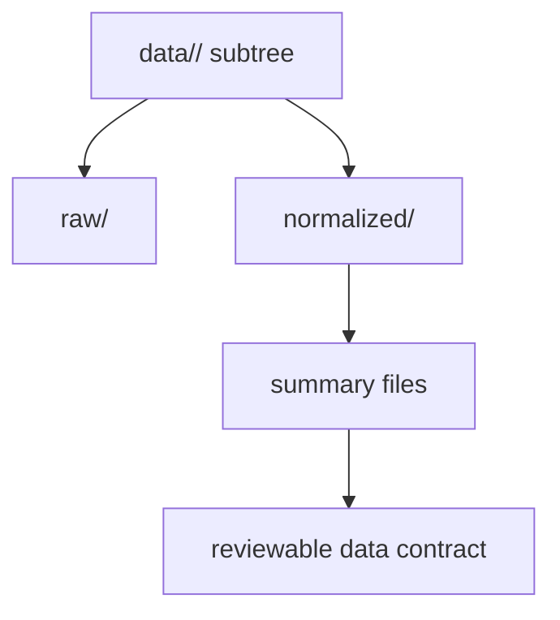

# Data Contracts

The package's data contracts are filesystem contracts. The public promise is
not a database schema. It is the tracked shape of `data/<source>/`, the
separation between `raw/` and `normalized/`, and the summary files that let a
reviewer verify what changed.

## Data Contract Model

This page should make filesystem shape feel contractual, not incidental. The
data contract exists so reviewers can tell what changed, where it lives, and
which source subtree still owns it.

## Contracted Shapes

- each supported source owns a stable subtree under `data/<source>/`
- raw and normalized outputs are separated so source fidelity and repository
  friendliness are both inspectable
- collection summaries and source-specific normalized outputs must remain
  reproducible from one repository state

## Contract Modules

- `data_downloader/contracts.py`
- `data_downloader/data_layout.py`
- `data_downloader/pipeline/summary_writer.py`

## Migration Warning

Renaming source directories or normalized filenames is a high-friction change.
It ripples into docs, report publishing, tests, and reviewer expectations.

## First Proof Check

- `data/`
- `src/bijux_pollenomics/data_downloader/data_layout.py`
- `tests/unit/test_data_layout.py`
- `tests/regression/test_repository_contracts.py`

## Design Pressure

The common failure is to talk about data contracts as if they were abstract
schemas, which hides the much more important promise around stable tracked file
shape and review clarity.
