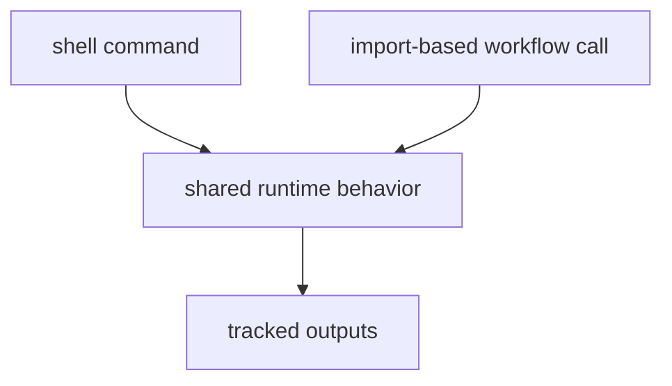

# Entrypoints and Examples

The package supports both shell and import-based entrypoints. The point of the
examples is to show the real public path into the same runtime behavior, not to
offer a second undocumented contract.

## Entrypoint Model



This page should show the examples as two doors into one runtime, not as two
different behavior contracts. The examples matter because they reveal the same
bounded workflow through both shell and import surfaces.

## Shell Examples

```bash
bijux-pollenomics collect-data all --version v66 --output-root data
bijux-pollenomics publish-reports --aadr-root data/aadr --version v66 --output-root docs/report --context-root data
```

## Import Examples

```python
from pathlib import Path

from bijux_pollenomics import collect_context_data, generate_published_reports

collect_context_data(Path("data"))
generate_published_reports(
    aadr_root=Path("data/aadr"),
    version="v66",
    output_root=Path("docs/report"),
    context_root=Path("data"),
)
```

## First Proof Check

- `src/bijux_pollenomics/cli.py`
- `src/bijux_pollenomics/data_downloader/api.py`
- `src/bijux_pollenomics/reporting/api.py`
- `tests/e2e/test_cli.py`

## Design Pressure

The easy failure is to let examples drift into shadow contracts, which makes
shell behavior and import behavior look similar while quietly diverging in real
usage.
