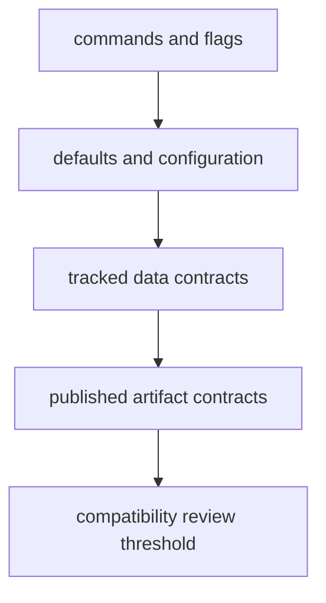

# Interfaces

This section defines which runtime surfaces are real contracts: command names,
defaults, tracked file layouts, published artifacts, and the narrow import
surface that other repository layers can safely rely on.

## Interface Model

This section should help a reader tell which surfaces are merely current behavior and which ones are stable enough to script against. If that distinction is vague, every output diff becomes harder to judge.

## Start Here

- open [CLI Surface](https://bijux.io/bijux-pollenomics/01-bijux-pollenomics/interfaces/cli-surface/) when the question starts from a
  command name or flag
- open [Artifact Contracts](https://bijux.io/bijux-pollenomics/01-bijux-pollenomics/interfaces/artifact-contracts/) when the public output files
  matter more than command syntax
- open [Data Contracts](https://bijux.io/bijux-pollenomics/01-bijux-pollenomics/interfaces/data-contracts/) when the tracked `data/` tree is the
  real dependency
- open [Compatibility Commitments](https://bijux.io/bijux-pollenomics/01-bijux-pollenomics/interfaces/compatibility-commitments/) before
  changing defaults, filenames, output shapes, or slugs that readers may have
  automated against

## Section Pages

- [CLI Surface](https://bijux.io/bijux-pollenomics/01-bijux-pollenomics/interfaces/cli-surface/)
- [API Surface](https://bijux.io/bijux-pollenomics/01-bijux-pollenomics/interfaces/api-surface/)
- [Configuration Surface](https://bijux.io/bijux-pollenomics/01-bijux-pollenomics/interfaces/configuration-surface/)
- [Data Contracts](https://bijux.io/bijux-pollenomics/01-bijux-pollenomics/interfaces/data-contracts/)
- [Artifact Contracts](https://bijux.io/bijux-pollenomics/01-bijux-pollenomics/interfaces/artifact-contracts/)
- [Entrypoints and Examples](https://bijux.io/bijux-pollenomics/01-bijux-pollenomics/interfaces/entrypoints-and-examples/)
- [Operator Workflows](https://bijux.io/bijux-pollenomics/01-bijux-pollenomics/interfaces/operator-workflows/)
- [Public Imports](https://bijux.io/bijux-pollenomics/01-bijux-pollenomics/interfaces/public-imports/)
- [Compatibility Commitments](https://bijux.io/bijux-pollenomics/01-bijux-pollenomics/interfaces/compatibility-commitments/)

## What This Section Settles

- which runtime surfaces are safe for operators and maintainers to script
  against
- which tracked file layouts and published artifacts are treated as stable
  contracts instead of convenient current shapes
- which changes require compatibility review because they would alter a visible
  repository or docs surface

## First Proof Check

- `src/bijux_pollenomics/cli.py` and
  `src/bijux_pollenomics/command_line/parsing/subcommands.py` for the command
  surface
- `src/bijux_pollenomics/config.py` for defaults and repository-path behavior
- `src/bijux_pollenomics/data_downloader/data_layout.py` and
  `src/bijux_pollenomics/data_downloader/contracts.py` for tracked file
  contracts
- `src/bijux_pollenomics/reporting/rendering/artifacts.py` and
  `src/bijux_pollenomics/reporting/bundles/paths.py` for publication artifact
  shapes
- `tests/e2e/test_cli.py` and `tests/regression/test_repository_contracts.py`
  for interface-facing proof

## Design Pressure

The easy failure is to document visible runtime behavior without stating clearly which commands, file layouts, and artifact shapes are actually treated as contracts.

## Boundary Test

If a dependency cannot be defended in terms of named commands, defaults, file
layouts, artifacts, examples, and tests, it is not yet an honest public
surface for this repository.
