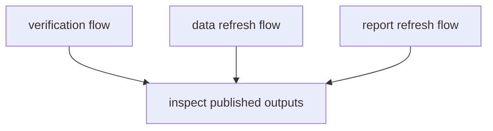

# Operator Workflows

Most operators meet the package through a short set of repository workflows.
The crucial distinction is between verification and mutation.

## Operator Workflow Model

This page should make operator flows legible by mutation level. The useful
split is not “simple versus advanced”; it is “checks only” versus “rewrites
tracked data or publication surfaces”.

## Common Operator Flows

- validate a checkout without changing tracked outputs
- refresh source data into `data/`
- regenerate published report bundles into `docs/report/`
- inspect the resulting atlas and country outputs in the docs site

## First Proof Check

- `makes/`
- `tests/e2e/test_cli.py`
- `tests/regression/test_repository_contracts.py`

## Design Pressure

The common failure is to describe all operator workflows as routine tasks,
which hides which ones widen the review surface and which ones simply prove
current state.
