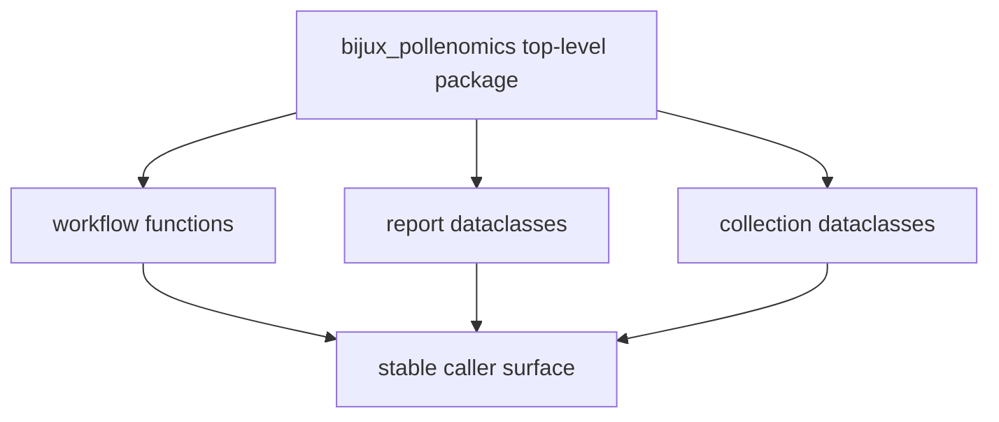

# Public Imports

The public import surface is the top-level `bijux_pollenomics` package. Use it
when a caller needs stable workflow functions, report dataclasses, collection
dataclasses, or `__version__`.

## Public Import Model

This page should make the top-level import surface feel curated. The point is
to give callers one stable place for workflow functions and dataclasses without
forcing them to depend on internal module layout.

## Supported Imports

- report dataclasses such as `CountryReport` and `PublishedReportsReport`
- collection dataclasses such as `DataCollectionReport` and `ContextDataReport`
- top-level workflow functions including `collect_data`,
  `collect_context_data`, `generate_country_report`,
  `generate_multi_country_map`, and `generate_published_reports`
- `__version__`

## Import Guidance

Prefer importing through `bijux_pollenomics` for stable caller-facing code.
Reach into internal modules only when changing the package itself.

## First Proof Check

- `packages/bijux-pollenomics/src/bijux_pollenomics/__init__.py`
- `tests/unit/test_command_line.py`

## Design Pressure

The easy failure is to let stable callers reach inward by habit, which makes
refactors harder and weakens the point of having a deliberate top-level import
surface.
