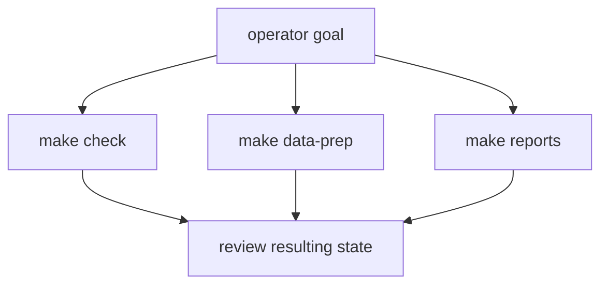

# Common Workflows

Most runtime work falls into a short list of repeatable workflows. The main
discipline is choosing the narrowest workflow that matches the goal.

## Workflow Choice Model

This page should help a reader choose the smallest command path that fits the
job. The important distinction is not convenience; it is how much tracked state
the chosen workflow is allowed to rewrite.

## Verify The Current State

Run `make check` when the goal is to validate code, docs, API, packaging, and
shared repository contracts without refreshing tracked scientific outputs.

## Refresh Tracked Data

Run `make data-prep` or the equivalent `bijux-pollenomics collect-data ...`
command when upstream source material or normalization logic needs a deliberate
refresh.

## Refresh Published Artifacts

Run `make reports` or `bijux-pollenomics publish-reports ...` when country
bundles or the atlas need regeneration from current tracked inputs.

## First Proof Check

- `make check`
- `make data-prep`
- `make reports`
- `bijux-pollenomics collect-data ...`
- `bijux-pollenomics publish-reports ...`

## Design Pressure

The easy failure is to jump straight to broad rebuild commands, which makes
routine diagnosis noisier and widens the tracked review surface without need.
