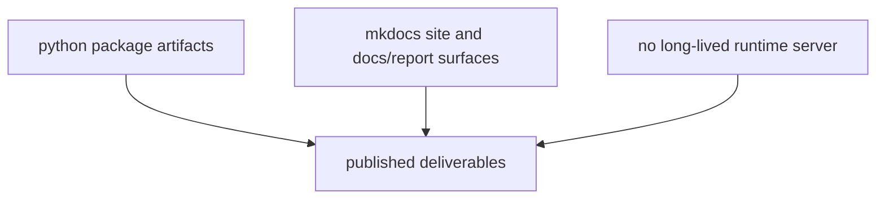

# Deployment Boundaries

The package does not deploy a long-lived application. Its deployable unit is a
publishable Python distribution plus the checked-in docs site that exposes the
generated outputs.

## Deployment Model

This page should make deployment boundaries feel narrow on purpose. The runtime
produces publishable packages and a docs site, not a continuously running
service with mutable owned state.

## What Gets Deployed

- Python package artifacts built from `packages/bijux-pollenomics/`
- the MkDocs site that exposes checked-in docs and `docs/report/` outputs

## What Does Not Get Deployed

- a runtime server for interactive data collection
- mutable remote state owned by this package

## First Proof Check

- `packages/bijux-pollenomics/`
- `docs/report/`
- MkDocs deployment workflow

## Design Pressure

The common failure is to read deployment language as if this repository were
shipping an always-on application, which confuses package publication with the
actual batch-and-docs model it uses.
