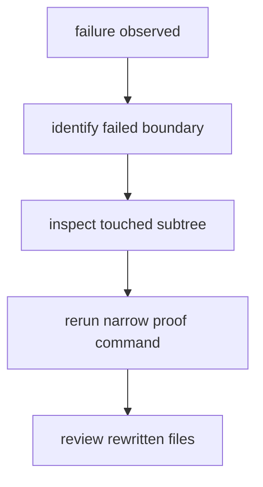

# Failure Recovery

Recovery starts by identifying which boundary failed.

## Recovery Model

This page should turn recovery into a boundary-tracing exercise, not a brute
force rerun habit. The point is to re-prove the smallest failed surface before
widening back into broader commands.

## Recovery Sequence

1. determine whether the failure happened during environment setup, data
   collection, report publishing, or docs build
2. inspect the tracked output tree touched by that step
3. rerun the narrowest command that proves the problem is fixed
4. review any rewritten tracked files before moving to broader commands

## First Proof Check

- the affected command and options
- the touched subtree under `data/` or `docs/report/`
- the narrowest proving command
- the matching regression tests

## Design Pressure

The easy failure is to recover by rerunning the largest workflow, which hides
the failed boundary and often rewrites more tracked state than the fix
actually required.
