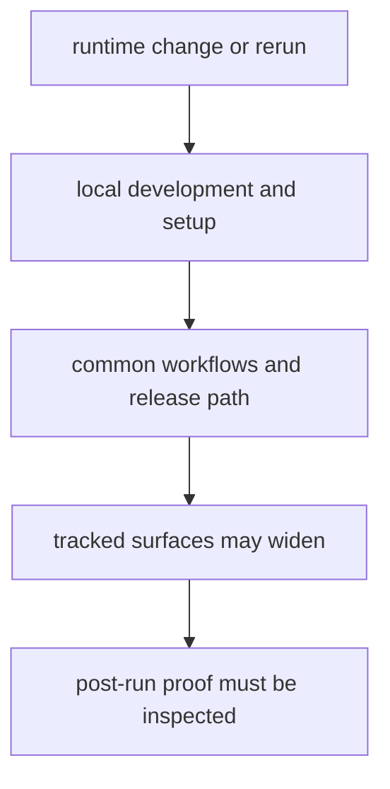

# Operations

This section defines how to run, verify, release, and recover the runtime
without widening the tracked review surface by accident. In pollenomics,
procedure matters because `data/` and `docs/report/` are checked-in outputs,
not disposable build products.

## Operations Model

This section should make one operational fact unavoidable: reruns here can rewrite checked-in evidence and publication surfaces. If the flow feels casual, maintainers will underestimate the review cost of a command.

## Start Here

- open [Local Development](https://bijux.io/bijux-pollenomics/01-bijux-pollenomics/operations/local-development/) when you are actively
  changing runtime behavior
- open [Common Workflows](https://bijux.io/bijux-pollenomics/01-bijux-pollenomics/operations/common-workflows/) when you need the normal verify,
  collect, or publish path
- open [Release and Versioning](https://bijux.io/bijux-pollenomics/01-bijux-pollenomics/operations/release-and-versioning/) before treating a
  change as publishable

## Section Pages

- [Installation and Setup](https://bijux.io/bijux-pollenomics/01-bijux-pollenomics/operations/installation-and-setup/)
- [Local Development](https://bijux.io/bijux-pollenomics/01-bijux-pollenomics/operations/local-development/)
- [Common Workflows](https://bijux.io/bijux-pollenomics/01-bijux-pollenomics/operations/common-workflows/)
- [Observability and Diagnostics](https://bijux.io/bijux-pollenomics/01-bijux-pollenomics/operations/observability-and-diagnostics/)
- [Performance and Scaling](https://bijux.io/bijux-pollenomics/01-bijux-pollenomics/operations/performance-and-scaling/)
- [Failure Recovery](https://bijux.io/bijux-pollenomics/01-bijux-pollenomics/operations/failure-recovery/)
- [Release and Versioning](https://bijux.io/bijux-pollenomics/01-bijux-pollenomics/operations/release-and-versioning/)
- [Security and Safety](https://bijux.io/bijux-pollenomics/01-bijux-pollenomics/operations/security-and-safety/)
- [Deployment Boundaries](https://bijux.io/bijux-pollenomics/01-bijux-pollenomics/operations/deployment-boundaries/)

## What Operations Means Here

- which operational path is safe for inspection versus state-changing rebuild
  work
- which commands widen the tracked review surface across `data/` and
  `docs/report/`
- which failure should send a reader into runtime diagnostics rather than into
  provenance or automation docs

## First Proof Check

- `src/bijux_pollenomics/command_line/runtime/handlers.py` for the operational
  entrypoints that trigger collection and reporting work
- `src/bijux_pollenomics/data_downloader/pipeline/staging.py` and
  `src/bijux_pollenomics/data_downloader/pipeline/summary_writer.py` for
  controlled rewrite behavior
- `src/bijux_pollenomics/reporting/bundles/staging.py` and
  `src/bijux_pollenomics/reporting/bundles/published_reports.py` for
  publication-facing output generation
- `tests/regression/test_data_collector.py` and
  `tests/regression/test_country_report.py` for the narrowest operational
  backstops that defend reruns

## Design Pressure

The common failure is to describe runtime procedures as if they were disposable local build steps instead of tracked repository rewrite paths.

## Boundary Test

If a procedure cannot explain which tracked surfaces it may rewrite and which
proof should be inspected afterward, it is not yet an operational practice this
repository should rely on.
