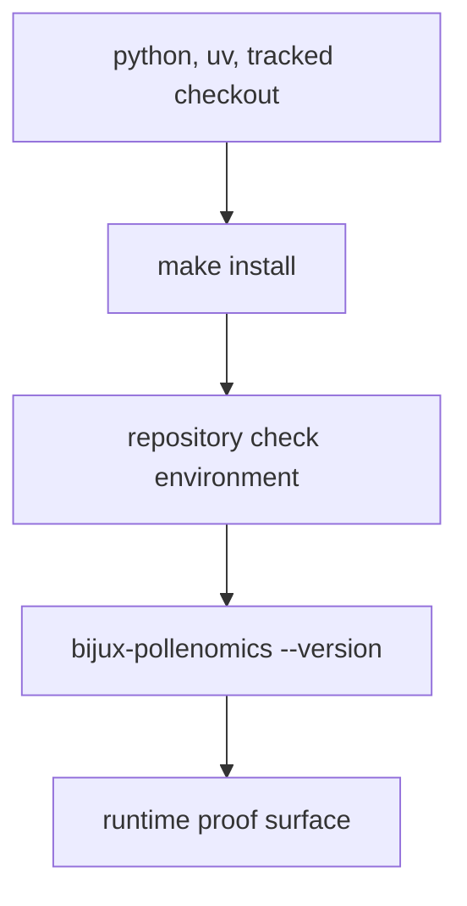

# Installation and Setup

The supported setup path is repository-first. Local setup should get a reader
to the runtime proof surface quickly instead of recreating the whole repository
in an ad hoc way.

## Setup Model



This page should make setup feel like a short path into the supported runtime
surface. The point is not to maximize setup options; it is to get a reader to a
proven local command path without inventing a second environment story.

## Expected Prerequisites

- Python 3.11
- `uv`
- a checkout that includes tracked `data/`, `docs/`, and `apis/` surfaces

## Recommended Setup Flow

```bash
make install
artifacts/root/check-venv/bin/bijux-pollenomics --version
```

`make install` creates the editable repository environment used for package,
docs, and verification work. Treat that environment as the supported local
entrypoint before troubleshooting command behavior elsewhere.

## First Proof Check

- `make install`
- `artifacts/root/check-venv/bin/bijux-pollenomics --version`
- `packages/bijux-pollenomics/tests/`

## Design Pressure

The easy failure is to describe setup as generic Python package installation,
which hides the repository-local environment and proof path the rest of the
handbook assumes.
