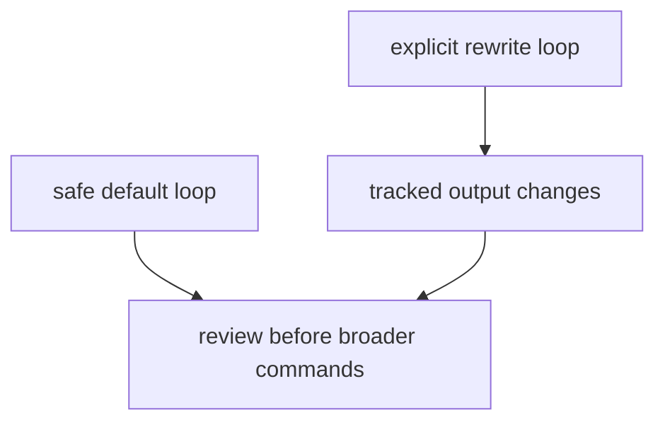

# Local Development

Local development should keep verification and rewrite operations separate.

## Local Development Model



This page should make local work feel disciplined by default. Verification is
the baseline loop; rewrite commands are a separate choice because they alter
tracked repository surfaces.

## Safe Default Loop

```bash
make lock-check
make lint
make test
make docs
make package-verify
```

## Rewrite Loop

Use explicit rewrite targets only when the intent is to refresh tracked outputs:

- `make data-prep`
- `make reports`
- `make app-state`

## First Proof Check

- `make lock-check`
- `make lint`
- `make test`
- `make docs`
- `make package-verify`

## Design Pressure

The common failure is to mix proof and mutation into one local loop, which
makes it harder to tell whether a failure came from code quality or from a
tracked-state rewrite.
