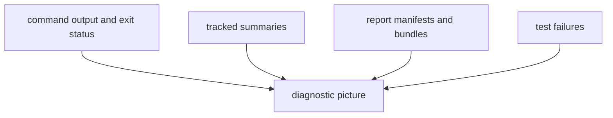

# Observability and Diagnostics

Observability in this package comes from explicit command output and reviewable
files rather than from a separate telemetry stack.

## Diagnostic Model

This page should make diagnostics feel concrete and local. Readers do not need
remote telemetry here; they need the small set of command, file, and test
surfaces that explain what went wrong.

## Diagnostic Surfaces

- command exit codes
- tracked summaries such as `data/collection_summary.json`
- generated report manifests under `docs/report/`
- unit, regression, and end-to-end test failures

## First Checks

- confirm the command and options being used match the documented defaults
- inspect whether `data/` or `docs/report/` changed unexpectedly
- compare the affected output family with the corresponding tests

## First Proof Check

- command exit codes and stderr
- `data/collection_summary.json`
- `docs/report/`
- `tests/unit/`, `tests/regression/`, and `tests/e2e/`

## Design Pressure

The common failure is to hunt for hidden observability that does not exist,
instead of using the explicit files and test layers the runtime already leaves
behind.
