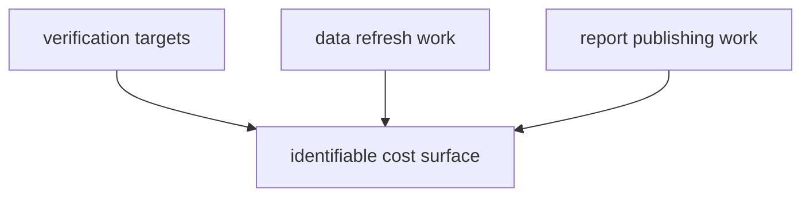

# Performance and Scaling

`bijux-pollenomics` is optimized for reproducibility and inspectability before
throughput.

## Performance Model

This page should show performance as workflow-shaped cost. The important thing
is not raw speed; it is keeping the expensive step identifiable so readers can
tell whether cost came from verification, collection, or publication.

## Current Performance Truths

- verification targets are much cheaper than full data refreshes
- source collection cost is dominated by upstream download and normalization work
- report publishing cost grows with the size of tracked source outputs and atlas
  assets

## Scaling Rule

Do not hide performance pressure by collapsing workflow boundaries. If a step is
slow, keep the slow step identifiable so reviewers and operators still know
whether the cost came from collection, reporting, or docs publication.

## First Proof Check

- `make check`
- `make data-prep`
- `make reports`

## Design Pressure

The easy failure is to hide slow work behind one broad command, which makes
performance pressure much harder to diagnose and much easier to misattribute.
