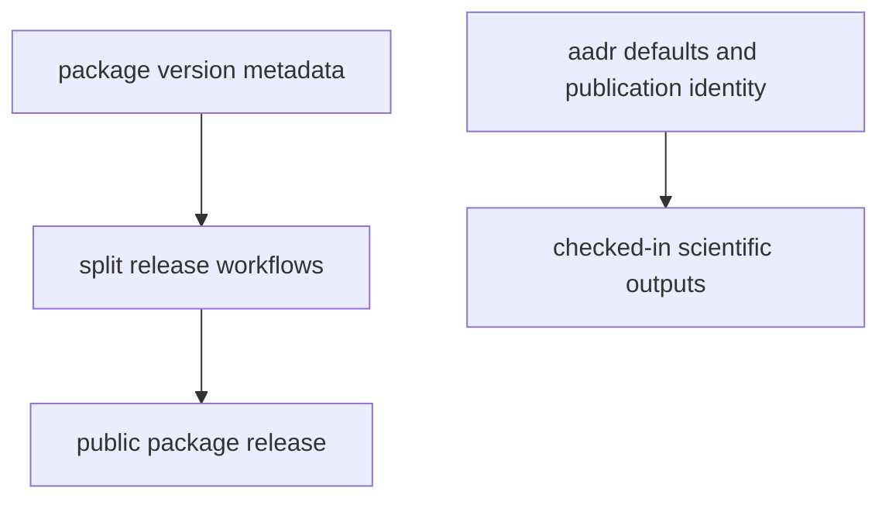

# Release and Versioning

The package version and published scientific outputs are related but not the
same artifact boundary.

## Versioning Model

This page should make release and runtime output identity separate but
connected. Package versioning governs the published distribution, while tracked
scientific outputs follow their own evidence and default-version logic.

## Version Anchors

- `tool.hatch.version` in `packages/bijux-pollenomics/pyproject.toml`
- installed package metadata resolved by `importlib.metadata`
- AADR input version defaults in `config.py`
- split release workflows:
  `release-artifacts.yml`, `release-pypi.yml`, `release-ghcr.yml`,
  and `release-github.yml`

## First Proof Check

- `packages/bijux-pollenomics/pyproject.toml`
- `config.py`
- `.github/workflows/release-*.yml`
- `.github/workflows/deploy-docs.yml`

## Design Pressure

The common failure is to blur package release state and scientific output
versioning together, which makes both publication review and evidence review
less honest.
