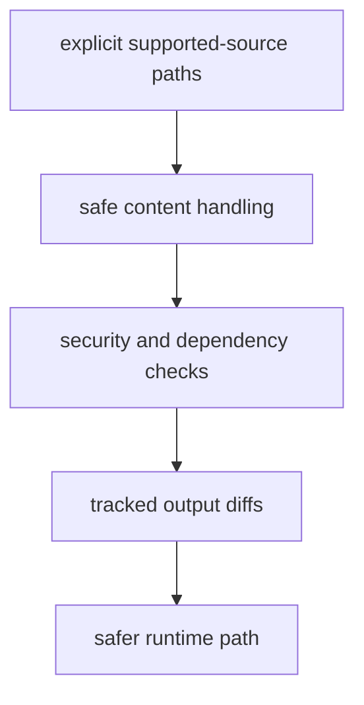

# Security and Safety

Security in `bijux-pollenomics` is mostly about trusted execution and safe
handling of fetched content.

## Safety Model

This page should make security look practical and review-centered. The runtime
stays safer by constraining fetch paths, parsing risky formats carefully, and
leaving suspicious changes visible in tracked diffs.

## Current Safety Anchors

- source files are collected through explicit supported-source paths
- XML handling uses `defusedxml`
- repository checks include security and dependency review targets
- tracked outputs make suspicious changes easier to inspect in review

## First Proof Check

- `defusedxml` usage
- collection paths that fetch external content
- tracked output diffs after a refresh
- repository security targets

## Design Pressure

The easy failure is to overstate security as a broad platform guarantee, when
the real protection here is tighter execution, safer parsing, and reviewable
output change.
