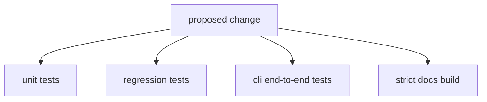

# Change Validation

Validate changes at the narrowest level that still proves the contract.

## Validation Model

This page should help readers choose proof by contract surface, not by habit.
The smallest honest validation path is the one that still proves the changed
boundary without widening into unnecessary cost.

## Common Validation Paths

- pure Python logic: unit tests
- output-shape or repository contract changes: regression tests
- command workflow changes: end-to-end CLI tests
- doc structure changes: strict MkDocs build

## First Proof Check

- unit tests for local logic changes
- regression tests for tracked output or repository-contract changes
- end-to-end CLI tests for workflow changes
- strict docs build for docs structure changes

## Design Pressure

The easy failure is to equate “more tests” with better validation, which often
hides the fact that the changed contract could have been proven more clearly at
a narrower layer.
