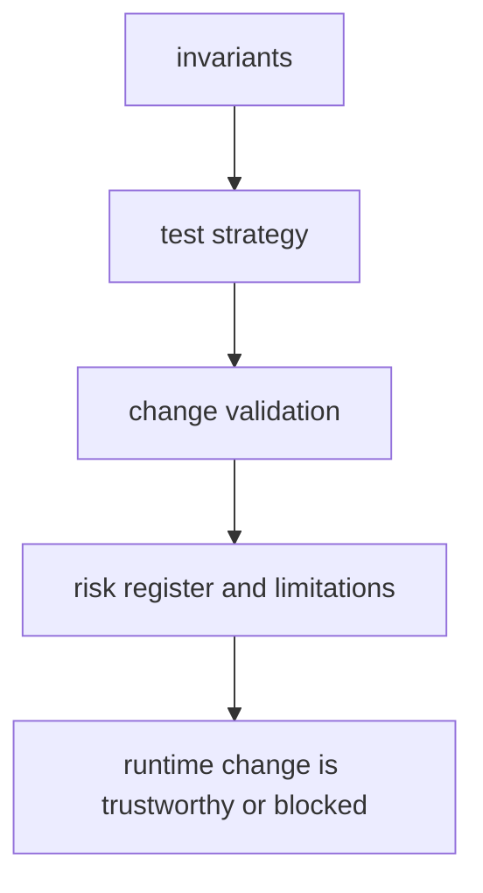

# Quality

This section defines what must remain true, what proof is required, and which
risks are serious enough to block a runtime change. In pollenomics, quality is
not only about Python behavior. It is also about whether visible atlas,
country-report, and tracked-data diffs are still explainable.

## Quality Model

This section should show quality as a proof path across code and checked-in outputs. If it reads like generic reassurance, maintainers will miss that visible atlas and report diffs are part of the quality bar too.

## Start Here

- open [Invariants](https://bijux.io/bijux-pollenomics/01-bijux-pollenomics/quality/invariants/) before changing package meaning
- open [Change Validation](https://bijux.io/bijux-pollenomics/01-bijux-pollenomics/quality/change-validation/) when you need the minimum proof
  for a real edit
- open [Risk Register](https://bijux.io/bijux-pollenomics/01-bijux-pollenomics/quality/risk-register/) when the runtime boundary or output
  surface feels under pressure

## Section Pages

- [Test Strategy](https://bijux.io/bijux-pollenomics/01-bijux-pollenomics/quality/test-strategy/)
- [Invariants](https://bijux.io/bijux-pollenomics/01-bijux-pollenomics/quality/invariants/)
- [Review Checklist](https://bijux.io/bijux-pollenomics/01-bijux-pollenomics/quality/review-checklist/)
- [Documentation Standards](https://bijux.io/bijux-pollenomics/01-bijux-pollenomics/quality/documentation-standards/)
- [Definition of Done](https://bijux.io/bijux-pollenomics/01-bijux-pollenomics/quality/definition-of-done/)
- [Dependency Governance](https://bijux.io/bijux-pollenomics/01-bijux-pollenomics/quality/dependency-governance/)
- [Change Validation](https://bijux.io/bijux-pollenomics/01-bijux-pollenomics/quality/change-validation/)
- [Known Limitations](https://bijux.io/bijux-pollenomics/01-bijux-pollenomics/quality/known-limitations/)
- [Risk Register](https://bijux.io/bijux-pollenomics/01-bijux-pollenomics/quality/risk-register/)

## What Quality Means Here

- which test layers defend code behavior versus tracked repository outputs
- which visible atlas or report consequences should be reviewed even after the
  tests pass
- which remaining limits must still be stated honestly so a green run is not
  mistaken for scientific completeness

## First Proof Check

- `tests/unit/` for narrow behavior checks on layout, source normalization, and
  configuration
- `tests/regression/test_data_collector.py`,
  `tests/regression/test_country_report.py`, and
  `tests/regression/test_repository_contracts.py` for tracked output and
  repository-surface proof
- `tests/e2e/test_cli.py` for the end-to-end command contract
- `docs/report/nordic-atlas/` for the public publication surface whose
  consequences quality review must keep visible

## Design Pressure

The easy failure is to stop at Python test results and never ask whether the resulting tracked outputs are still honest enough to publish.

## Boundary Test

If a runtime claim cannot be backed by named tests, explicit invariants, updated
docs, and a clear statement of remaining limits, it is not yet ready for
repository review.
