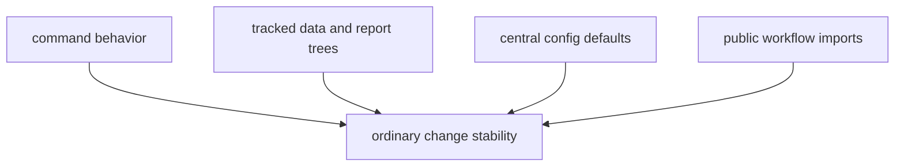

# Invariants

Certain truths should remain stable across ordinary package changes.

## Invariant Model

This page should make invariants look like the small set of truths that let the
rest of the handbook stay coherent. If these move casually, readers lose the
anchors that connect runtime behavior to tracked evidence and public entrypoints.

## Package Invariants

- commands either validate or rewrite tracked outputs deliberately
- source outputs stay grouped by source under `data/<source>/`
- report outputs stay grouped under `docs/report/`
- defaults in `config.py` remain the single obvious source for package-wide
  paths and publication identity
- public imports from `bijux_pollenomics` continue to describe real workflow
  entrypoints

## First Proof Check

- `tests/unit/test_config.py`
- `tests/unit/test_data_layout.py`
- `tests/regression/test_repository_contracts.py`

## Design Pressure

The common failure is to treat every stable convention as flexible, which makes
ordinary refactors widen into contract drift across commands, trees, and public
imports.
