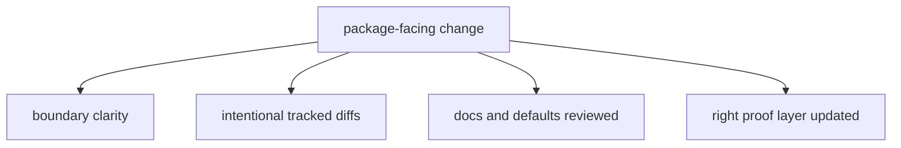

# Review Checklist

Use this checklist for package-facing changes.

## Review Model

This page should make review feel like contract inspection, not just code
reading. The checklist matters because the package changes durable files and
public surfaces that are easy to miss if review stays source-only.

## Checklist

- does the change keep collection, reporting, and maintenance boundaries clear
- are tracked `data/` or `docs/report/` diffs intentional and explained
- do docs reflect any renamed paths, commands, or output contracts
- is the narrowest useful test layer updated
- if defaults changed, was the public contract impact reviewed explicitly

## First Proof Check

- package boundary still clear
- tracked diffs intentional and explained
- docs updated with public changes
- right test layer updated
- default changes reviewed explicitly

## Design Pressure

The easy failure is to review code in isolation from tracked outputs and docs,
which is exactly how public contract drift slips through.
